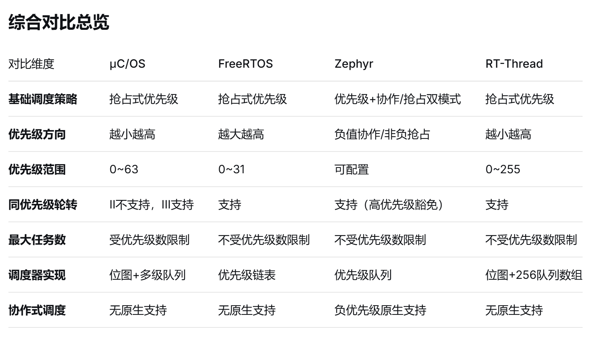

# **基于 ARM Cortex-M3 的轻量级 RTOS 内核设计与实现**

面试官通常会围绕“动机与架构 → 调度器 → 上下文切换 → 同步通信 → 内存管理 → 测试 → 对比优化”逐层追问。清单如下：

## 一、项目背景与整体设计

### 1.为什么选择自研 RTOS？是学习目的还是实际项目需求？

### 2.参考了哪些 RTOS？FreeRTOS、RT-Thread、uCOS？哪些是借鉴，哪些是自己实现？

FreeRTOS 的做法可以拆成“通用思想”和“FreeRTOS 特有实现”两类，面试时按这个分类答最清楚：

通用思想：TCB + 每优先级一条就绪链表 + 延时链表按唤醒 tick 有序 + 事件阻塞链表按优先级排序 + 阻塞超时 = “事件表 + 延时表”双挂 + PendSV 做上下文切换。

各家差异：


内存管理上：
- ucos采用固定大小内存块分区，每个分区中所有内存块大小相同，分配和回收的时间完全确定，不会有外部碎片。
- freertos实现了五种内存管理方案，将选择权交给开发者
- Zephyr采用伙伴内存分配算法管理内存池，支持任意大小的内存块分配，只能合并属于同一父块的伙伴块，每个层级维护位图
- RT-Thread提供三套动态堆算法：小内存管理算法（内存小于2MB时，通过双向链表合并相邻内存块）、SLAB管理算法（将内存按大小分为多个区域，相同大小统一管理）、memheap管理算法（将多个不连续内存堆合并大内存）；提供静态内存池。

### 3.与 FreeRTOS 最小内核相比，你的内核有什么差异和优势？

没有软件定时器和事件组等组件，暂时只实现了调度器之类的任务管理，事件通信只有队列信号量互斥量任务通知等，内存管理只实现了heap 4

可讲的优势方向：确定性（时间复杂度可证明）、静态内存（零 `pvPortMalloc`）、裁剪粒度、代码可读性/可审查性。

劣势要主动认：生态（无几十个端口、无第三方中间件）、认证（FreeRTOS 有 MISRA 报告、SAFERTOS 有 IEC 61508 SIL3 / ISO 26262 ASIL D）、测试充分性。

### 4.内核由哪些模块组成？目录结构、代码量大概多少？

数据结构层：list.c、queue.c
核心层kernel：task.c、通信、memory.c
移植层：port.c
config.h

### 5.从复位到第一个任务运行，启动流程是什么？

main() → 硬件时钟/串口初始化 → xTaskCreate() → vTaskStartScheduler()。

vTaskStartScheduler()：
- 创建空闲任务（优先级 0）分配 pxIdleTaskTCBBuffer；
- xSchedulerRunning = pdTRUE；
- xTickCount = 0；
- 调用 xPortStartScheduler()。

xPortStartScheduler()：
- 写 SHPR3 把 PendSV / SysTick 优先级都设为 configKERNEL_INTERRUPT_PRIORITY（最低）
- 配置 SysTick 重装值与 CTRL
- 最后调用 vPortStartFirstTask()。

vPortStartFirstTask()：
- 从向量表首字取初值重设 MSP；
- 开中断；
- 触发 SVC。

vPortSVCHandler()：
- ldr r3, =pxCurrentTCB → 取 pxTopOfStack → ldmia r0!, {r4-r11} 恢复软件寄存器 → msr psp, r0 → mov r0, #2; msr control, r0（**privileged + 使用 PSP**）→ bx r14，r14 被置为 0xFFFFFFFD，硬件按 PSP 弹出剩下 8 个字（R0-R3/R12/LR/PC/xPSR），PC 即为任务入口函数。这样就进入了第一个任务的 Thread 模式。

### 6.如何初始化 SysTick、PendSV、SVC？它们的优先级怎么配置？

Cortex-M 端口里全是直接写 NVIC 优先级寄存器：
- PendSV、SysTick：`SHPR3` 的 bit16-23 / bit24-31 都写入最低级，保证二者互不抢占、且永远在所有外设 ISR 之后执行。
- SVC：M3 端口不显式设置，保持复位值（优先级最高），因为启动第一个任务必须立即执行；SVC 只用于启动。
- SysTick 的重装值 = configCPU_CLOCK_HZ / configTICK_RATE_HZ - 1，SysTick->CTRL = CLKSOURCE | TICKINT | ENABLE（位 2/1/0）。

### 8.可移植性怎么设计？移植层包含哪些文件？

RTOS 的移植层（Porting Layer）本质上是连接 OS 内核与具体 CPU 架构/硬件平台的适配代码，目的是让内核与硬件解耦。
启动调度器、初始化任务栈、实现上下文切换（通过 PendSV/SVC）、管理临界区和中断、配置系统节拍

### 9.有没有裁剪配置？哪些功能可以通过宏关闭？

可以通过config.h进行裁剪

可以通过宏配置：
- 系统配置：系统节拍频率，默认时间片，最大优先级数
- 功能开关：互斥量、信号量、队列
- 调试配置：使能调试、使能断言、使能栈检查
- 内存配置：堆大小

### 10.为什么选 Cortex-M3？M3、M4、M0 在移植上有什么区别？

M3 的“移植友好点”：有 CLZ（能在一个时钟周期内完成对最高位“1”的查找，可 O(1) 选最高优先级就绪任务）、有硬件 SDIV/UDIV 与单周期乘法、标准 4 位优先级、ARMv7-M 完整的 Thumb-2 指令集，还没有 FPU 带来的浮点上下文问题。

三者的移植差异：

**M0/M0+（ARMv6-M）：**
- 无 BASEPRI → 临界区只能用 PRIMASK（`cpsid i`）全屏蔽，因此无法支持“零延迟中断”，中断延迟上限变差；
- 无 CLZ → configUSE_PORT_OPTIMISED_TASK_SELECTION 必须为 0，退化为普通循环找非空就绪链表；
- 无 IT 块/条件执行 → 汇编写法不同（FreeRTOS 用 portable/GCC/ARM_CM0，临界区宏和汇编都与 M3 分家）。

**M3**：如上。

**M4/M4F（ARMv7E-M + FPv4-SP）**：多了 FPU。
- 端口要额外保存浮点上下文；
- 还需要 configUSE_TASK_FPU_SUPPORT 决定“是否给任务分配浮点上下文”，并在启动代码里打开 CPACR 的 CP10/CP11。
-  FPU 寄存器是每个任务独占的，切换开销变大。

### 11. 32 级任务优先级怎么定义？占多少 RAM？

数值越大越优先（与 μC/OS 相反，要说清）。RAM 开销可以直接算：
核心代码：约2000行C代码
移植代码：约200行汇编代码
资源占用：ROM < 8KB, RAM < 2KB

### 12.有没有空闲任务？空闲任务做什么？

有，vTaskStartScheduler() 强制创建，优先级固定 0（最低）。prvIdleTask() 循环做四件事：
- prvCheckTasksWaitingTermination()：回收自杀任务的 TCB 与栈；
- configIDLE_SHOULD_YIELD == 1 时，若就绪表中 0 优先级链表长度 > 1（说明有应用任务也是 0 优先级），`taskYIELD()` 让出，避免抢占“同优先级应用任务”的时间片；
- configUSE_IDLE_HOOK == 1 时调用 vApplicationIdleHook()——**低功耗 WFI、喂狗、内存水线巡检、CPU 负载统计都挂在这里**；
- configUSE_TICKLESS_IDLE != 0 时在空闲循环里进入 tickless 休眠。

### 13.有没有断言、错误码、HardFault 处理？

有断言，无其他
- 断言：configASSERT( x ) 由用户定义，内核到处在用——ISR 优先级校验、队列/互斥量用法校验、调度器状态校验全靠它。

## 二、任务管理与调度器

### 15.任务控制块 TCB 包含哪些字段？每个字段作用是什么？

````c
typedef struct tskTaskControlBlock
{
    /* 0. 栈顶指针（必须是第一个成员） */
    volatile StackType_t * pxTopOfStack;

    /* 1. 状态列表项：将任务挂载到就绪/阻塞/挂起列表 */
    ListItem_t xStateListItem;

    /* 2. 事件列表项：将任务挂载到事件列表（如队列、信号量） */
    ListItem_t xEventListItem;

    /* 3. 任务优先级 */
    UBaseType_t uxPriority;

    /* 4. 任务栈起始地址 */
    StackType_t * pxStack;

    /* 5. 任务名（仅用于调试） */
    char pcTaskName[ configMAX_TASK_NAME_LEN ];

    #if ( ( portSTACK_GROWTH > 0 ) || ( configRECORD_STACK_HIGH_ADDRESS == 1 ) )
        StackType_t * pxEndOfStack; /* 栈结束地址 */
    #endif

    #if ( configUSE_MUTEXES == 1 )
        UBaseType_t uxBasePriority;  /* 基础优先级（优先级继承用） */
        UBaseType_t uxMutexesHeld;   /* 持有的互斥量数量 */
    #endif

    #if ( configGENERATE_RUN_TIME_STATS == 1 )
        uint32_t ulRunTimeCounter; /* 任务运行总时间 */
    #endif

    #if ( configUSE_TASK_NOTIFICATIONS == 1 )
        volatile uint32_t ulNotifiedValue; /* 任务通知值 */
        volatile uint8_t ucNotifyState;    /* 任务通知状态 */
    #endif

    #if ( INCLUDE_xTaskAbortDelay == 1 )
        uint8_t ucDelayAborted; /* 延时是否被中止 */
    #endif

} tskTCB;

````

### 16.任务有哪些状态？状态迁移图怎么画？

Running / Ready / Blocked / Suspended / Deleted

迁移边：
- Ready↔Running（被抢占/被选中）；
- Running→Blocked（vTaskDelay 或等待事件），Blocked→Ready（tick 到期或在延时表被摘除时事件满足）；
- Running/Ready→Suspended（vTaskSuspend，挂起态不参与调度、也不被 tick 计超时），Suspended→Ready（xTaskResumeFromISR）；
- 任意态→Deleted。

### 17.就绪列表怎么组织？数组+链表，还是位图+链表？

FreeRTOS 是 **“数组 + 每优先级一条双向环形链表 + 一个位图”**：
- List_t pxReadyTasksLists[configMAX_PRIORITIES]，下标即优先级，0 最低；
- 每条链表用 pxIndex 指向“上一次运行的那个任务”，配合 listGET_OWNER_OF_NEXT_ENTRY 实现**同优先级轮转**；
- UBaseType_t uxTopReadyPriority 是位图，某优先级有就绪任务就把对应位置 1；只保留“最高位”的快速查询能力。

### 18.如何快速找到最高优先级任务？用 CLZ 指令吗？时间复杂度多少？

读取全局变量，寻找最高位1，复杂度 O(1)

维护一个32位的全局变量，每一位代表一个优先级链表是否为空，使用CLZ指令查找最高优先级
-  置位（标记有任务就绪）：uxTopReadyPriority |= (1UL << uxPriority);
-  清零（标记无任务就绪）：检查链表是否为空，若空则清零 uxTopReadyPriority &= ~(1UL << uxPriority);

### 19.同优先级任务的时间片轮转怎么实现？

不需要时间片计数器，靠“环形链表的 pxIndex 每次切换都前进一格”实现。

vTaskSwitchContext()：
- 若当前任务已不是最高优先级 → taskSELECT_HIGHEST_PRIORITY_TASK()：选最高非空就绪链表，listGET_OWNER_OF_NEXT_ENTRY(pxCurrentTCB, &pxReadyTasksLists[uxTopPriority])（把 pxIndex 移到下一个，返回它的 owner）→ 天然轮转；
- 若当前任务仍是最高的，但同优先级链表长度 > 1（configUSE_TIME_SLICING == 1），xTaskIncrementTick() 会触发一次切换 → 走的就是上面这条路径 → 轮到同优先级的下一个任务。

### 20.时间片大小怎么定？是否可配置？

时间片等于 1 个 tick，没有“每个任务可设时间片长度”的 API
- configTICK_RATE_HZ（常取 100/1000）→ 改变时间片粒度，代价是 tick 中断开销与延时分辨率。

对比：μC/OS-III、RT-Thread 支持每线程时间片；若自研内核要支持，就得在 TCB 里加 uxTimeSlice/uxTimeSliceRemain，并在 tick 里递减、为 0 才轮转。

### 21.SysTick 中断里具体做了什么？如何更新延时和唤醒？

xPortSysTickHandler() ：
- 进入临界区 → 调用xTaskIncrementTick() 判断是否要切换任务 → 退出临界区 / 触发 PendSV 切换任务

xTaskIncrementTick() 做的事：
- 检查调度器状态，被挂起则直接返回
- 递增系统节拍：将全局变量 xTickCount 加 1
- 处理节拍计数器溢出
- 检查并唤醒到期任务 → 记录返回值

### 22.延时链表怎么组织？按唤醒时间排序插入吗？插入复杂度多少？

所有调用 vTaskDelay() 等函数进入阻塞态的任务，都会被按照其唤醒时间（当前 xTickCount + 延时值） 升序插入到延时列表中。

FreeRTOS 实际维护了两个延时列表（pxDelayedTaskList 和 pxOverflowDelayedTaskList），以优雅地处理 xTickCount 溢出时的任务排序问题。

xNextTaskUnblockTime：这是一个全局变量，记录了延时列表中最早将要唤醒的任务的时间。每次 SysTick 中断只需要和它比较一次，就能判断出是否有任务需要唤醒，无需遍历整个延时列表，大大提高了效率

### 23.阻塞延时和定时唤醒有什么区别？

区别在“靠谁唤醒”：
- 纯延时（阻塞延时）：只挂延时链表，唤醒源唯一，用绝对时刻算延时量，可消除累计抖动，适合周期任务。
- 带超时的等待（定时唤醒）：同时挂在**事件链表 + 延时链表**两处，**谁先到谁生效**；事件先到就把它从延时链表里摘掉；tick 先到就由 tick 循环把它从事件链表里摘掉，并返回超时结果。

### 24.任务创建时栈怎么分配？栈增长方向是什么？

通过一个宏来适配不同架构的栈增长方向。这个宏在移植层中定义：
- 值为 -1：表示栈向下增长（从高地址向低地址生长），这是 ARM Cortex-M 等大多数架构的典型行为。
- 值为 1：表示栈向上增长（从低地址向高地址生长）

为了防止栈在增长时覆盖到相邻的 TCB，xTaskCreate 会根据 portSTACK_GROWTH 的值来决定先分配栈还是先分配 TCB
- 当栈向下增长时 ：代码会先分配任务栈，再分配 TCB；栈顶指针指向栈内存的高地址末端
- 当栈向上增长时 ：代码会先分配 TCB，再分配任务栈；栈顶指针指向栈内存的低地址起始端

### 25.任务删除流程是什么？TCB、栈、队列阻塞节点怎么回收？

分两种情况：
- 删别人：从各个链表中摘掉 → 直接释放 pxStack 与 pxTCB。
- 删自己：不能立刻释放自己的栈（还在用），所以从链表中移除 + 增加要清理的任务个数，然后主动让出 CPU；由空闲任务收尸。

队列阻塞也要移除，否则在阻塞被唤醒时会解引用一块未定义的内存。

### 26.如果任务删除自身，调度器怎么返回？

不返回，移出调度链表，放入待终止链表，触发上下文切换。

### 27.如果删除持有互斥量的任务，会发生什么？

死锁 + 悬垂指针
- 互斥量的指向已释放的 TCB 内存 → 互斥量永远处于“被持有”状态，任何后继都将永久阻塞；
- 更糟的是下一次有任务阻塞在这个互斥量上时，会解引用已经释放掉的 TCB——若这块内存被重新分配（比如新任务），就会去改“别人的优先级”

正确做法：
- 绝不在持有互斥量时删除任务；
- 改用看门狗/软定时器 + 超时值让阻塞方可超时退出；
- 真需要“删除即释放”，在内核层面实现 vTaskDelete 时扫描 uxMutexesHeld 并强制释放（μC/OS 的思路）。

### 28.任务优先级能否动态修改？修改后就绪列表怎么调整？

可以。处理逻辑：
- 若目标是当前任务且在跑：pxCurrentTCB->uxPriority = uxNewPriority；若它持有互斥量，则同步更新 uxBasePriority 与所有已持有互斥量事件项的 xItemValue；
- 若目标在就绪态：先从原优先级就绪链表移除，插到新链表，若新优先级高于当前任务优先级则触发调度，立即切换；
- 若目标在阻塞/延时态：只改优先级与事件项值（不摘链表），因为它挂在事件表里的顺序由 xItemValue 决定，改了值顺序自动生效；
- 限制：降低优先级不能低于“继承来的当前优先级”（被互斥量提升中），会把 `uxBasePriority` 一起压下去而不是拒绝。

### 29.空闲任务优先级是多少？什么时候运行？

最低。它只在“没有任何其他就绪任务”时运行（其他任务全阻塞/挂起/被删）。

### 30.如果所有任务都阻塞，调度器怎么走？

那么最高非空就绪链表只剩 0，选中空闲任务；空闲任务检查自杀任务垃圾回收。tick 中断照常在跑，每次 tick 检查延时链表看有没有任务该醒。

### 31.如何防止高优先级任务一直运行导致低优先级任务饿死？

合理分层：把长时间计算放到低优先级，把只做短触发的高优先级任务保持在延时和等信号量的阻塞态。

其他RTOS：
- 动态优先级调整：一个任务等待的时间越长，其临时优先级就被逐步提高，直到它最终被调度执行，执行完毕后优先级再恢复原状
- 限制高优先级任务执行

### 32.调度器上锁/解锁怎么实现？

靠一个计数器 uxSchedulerSuspended（允许嵌套）：
- vTaskSuspendAll()：++uxSchedulerSuspended（只关调度，不关中断，这是它与临界区的本质区别，所以里面可以放长操作，但绝不能调用会引起阻塞的 API）；
- xTaskResumeAll()：--uxSchedulerSuspended，减到 0 时把积压的任务搬回各自就绪表、把积压的 tick 补算处理（可能引发切换），最后如需要则触发调度；返回值告诉调用者“是否已经发生了切换”。

对比：taskENTER_CRITICAL()/taskEXIT_CRITICAL() 是用 BASEPRI 屏蔽中断（也会屏蔽 PendSV，因此不会切换），适合极短操作。内存分配器内部用的就是挂起调度器而不是临界区，因此 pvPortMalloc 不能在 ISR 里调用。

### 33.中断中如何触发调度？为什么用 PendSV？

ISR 里调用任一 ...FromISR() API 时传入 pxHigherPriorityTaskWoken，API 内部若唤醒了更高优先级任务就把它置 pdTRUE，ISR 尾部执行，把切换挂起而不是就地切换。

用 PendSV 的三个理由：
- 它是可“挂起（pending）”的异常，可以在任意嵌套 ISR 里安全地登记一次切换请求，不需要区分当前中断优先级；
- 它的优先级最低，因此切换只会发生在“所有 ISR 都退出之后”（尾链机制），避免了在 ISR 中间切换上下文导致中断嵌套结构被破坏；
- 所有上下文切换集中在唯一一处汇编里，硬件压栈（进入异常）与出栈（退出异常）自动完成一半工作，代码量极小，也便于分析最坏执行时间。

### 34.调度最坏执行时间大概多少？关中断时间多长？

- 选任务：__clz 版本 O(1)；
- 上下文保存/恢复
- 最长的关中断区间其实在临界区而不是切换里：最坏的是延时表有序插入（O(延时任务数)）、解锁队列的阻塞链表遍历——都和“任务/空闲块数量”线性相关，所以内核最坏执行时间是数据规模相关的，不是常数，这一点要主动说。
- 测量方法：DWT->CYCCNT 在操作前后取值，或用 GPIO 翻转 + 示波器。

### 35.栈溢出怎么检测？魔数、高水位还是硬件 MPU？

- 创建任务时把整块栈填成 0xA5，切换时检查栈尾最后 20 字节是否还被 0xA5 覆盖，被改写 → 认为溢出。
- 触发后调用栈溢出钩子。

### 36.任务栈大小怎么确定？最大栈使用量测过吗？

先给足，再测水线，再收敛：
- 根据任务的局部变量、数组的使用情况估测
- 调试时用提供的栈水线检测的API，返回的是历史最小剩余量（单位：字，不是字节）——栈在创建时被 0xA5 填充；
- 拿“给的大小 − 剩余量”得到峰值用量，再留 30%~50% 余量；
- 边界条件要多测。

## 三、上下文切换与 Cortex-M3 移植

### 37.Cortex-M3 的异常模型是什么？MSP 和 PSP 怎么用？

Cortex-M3 有 Thread 模式（跑任务）与 Handler 模式（跑异常/中断）两种模式、特权/非特权两级权限、MSP/PSP 两个栈指针：
- 复位后处于 Thread + 特权 + 使用 MSP；
- 中断和内核代码用 MSP，任务用 PSP，切换任务时只改 PSP，MSP 始终指向主栈，所以中断嵌套不需要切换栈指针，ISR 的栈开销集中在 MSP 上，可以被独立评估；
- 异常返回时硬件从 EXC_RETURN 决定回哪个栈。

### 38.为什么 PendSV 优先级要设最低？

因为切换必须在“没有未处理的异常”这个干净时刻进行：
- 若 PendSV 的优先级比某个 ISR 高，PendSV 可以在 ISR 执行到一半时切入，此时该 ISR 的硬件压栈帧还压在（当时的）PSP 上，保存的现场会包含“被打断的 ISR 的中间状态”，一旦切走再切回，栈的增长/回收就与中断嵌套层次耦合，极易出错；
- 设为最低后，硬件保证“只有所有可抢占的异常都退出后”PendSV 才会执行，于是每个任务都只在自己的、完整的上下文里被切换；
- 由于它最低，它自己永远不会抢占任何 ISR，也就天然避免了“上下文切换过程中的嵌套切换”。

### 39.SVC 用来做什么？第一次任务启动怎么切到 PSP？

在 Cortex-M 上，FreeRTOS 把 SVC 异常专门用于启动调度器后的第一个任务。

原因在于：调度器启动前，CPU 运行在线程模式 + MSP（主栈指针）下，执行的是 main() 的代码。而任务应该运行在线程模式 + PSP（进程栈指针）下。要从 MSP 切到 PSP，并且恢复某个任务的完整上下文，唯一干净的办法就是触发一次异常，然后在异常返回时切换栈指针。SVC 就是为此而生的。

因此，vPortStartFirstTask() 会执行一条 svc 0 指令，主动触发 SVC 异常，由 vPortSVCHandler 完成第一个任务的启动。

- main() 在调用 vTaskStartScheduler() 之前，已经通过 xTaskCreate() 创建了若干任务。每个任务的栈在创建时就被初始化。
- 调度器初始化完成后，会调用 xPortStartScheduler()，最终执行到 vPortStartFirstTask()。
- vPortStartFirstTask() ：
  - 把向量表偏移寄存器 VTOR 重新加载，确保中断向量表正确。
  - 使能全局中断。
  - 执行 svc 0，触发 SVC 异常。
- vPortSVCHandler 恢复第一个任务：恢复栈，开中断，返回psp

### 40.上下文切换保存哪些寄存器？哪些硬件自动保存？哪些手动保存？

硬件自动压栈 8 个字（32 字节）：xPSR、PC、LR、R12、R0-R3。

软件手动保存 8 个字：R4-R11。

### 41.汇编上下文切换代码流程是什么？入栈、出栈顺序？

````c
void xPortPendSVHandler( void )
{
    __asm volatile (
        "   mrs r0, psp                     \n"  // 1. 获取当前任务的 PSP
        "   isb                             \n"
        "   ldr r3, pxCurrentTCBConst       \n"  // 2. 获取当前 TCB 的地址
        "   ldr r2, [r3]                    \n"
        "   stmdb r0!, {r4-r11, r14}        \n"  // 3. 手动保存 R4-R11 和 R14
        "   str r0, [r2]                    \n"  // 4. 将新栈顶保存到 TCB 的首个成员
        "   stmdb sp!, {r0, r3}             \n"  // 5. 将 R0 和 R3 压入 MSP 保护的栈中
        "   mov r0, %0                      \n"
        "   msr basepri, r0                 \n"  // 6. 屏蔽中断，进入临界区
        "   dsb                             \n"
        "   isb                             \n"
        "   bl vTaskSwitchContext           \n"  // 7. 调用 C 函数选择下一个任务
        "   mov r0, #0                      \n"
        "   msr basepri, r0                 \n"  // 8. 退出临界区，开中断
        "   ldmia sp!, {r0, r3}             \n"  // 9. 从 MSP 栈中恢复 R0 和 R3
        "   ldr r1, [r3]                    \n"  // 10. 获取新任务的 TCB
        "   ldr r0, [r1]                    \n"  // 11. 获取新任务的栈顶
        "   ldmia r0!, {r4-r11, r14}        \n"  // 12. 手动恢复 R4-R11 和 R14
        "   msr psp, r0                     \n"  // 13. 更新 PSP 为新任务的栈顶
        "   isb                             \n"
        "   bx r14                          \n"  // 14. 异常返回，硬件自动恢复剩余寄存器
    );
}
````

### 42.如何切换 PSP？什么时候用 MSP？

PSP 只能靠 `MSR PSP, Rn`修改，只在两处改它：vPortSVCHandler 里与 `PendSV_Handler` 收尾。

MSP 的使用时机：
- 复位到第一个任务启动之前（整个初始化都在 MSP 上跑）；
- 所有异常/中断处理期间；
- 内核代码（切换上下文、递增tick计数器等）都在 Handler 模式里跑，用的就是 MSP。

### 43.中断嵌套时会发生上下文切换吗？

不会在嵌套过程中切换，切换只可能在“中断返回到 Thread 模式之前”发生一次：
- ISR 里调 ...FromISR() → 置 PendSV 挂起位；
- 若发生嵌套，多个 ISR 会在 MSP 上叠自己的压栈帧，PendSV 因为优先级最低，必须等所有 ISR 全部退出才执行；

### 44.PendSV 中再次触发 PendSV 会怎样？

不会立刻重入——同优先级的异常不能抢占正在执行的自身，只会把 PENDSV 挂起位置 1。行为是：
- PendSV 返回时，NVIC 检查到 PendSV 又处于挂起态，于是再次进入 PendSV；
- PendSV 内部在调用 vTaskSwitchContext 前后用 BASEPRI 关中断，所以“PendSV 执行期间被 SysTick 打断”也不会破坏它。

### 45.SysTick 和 PendSV 同时挂起，谁先执行？

PendSV 先执行。两者优先级都被设成最低级，按 ARM 的规则，同优先级时异常号小的先执行：PendSV = 异常 14，SysTick = 异常 15 → PendSV 赢。

### 46.临界区用 PRIMASK 还是 BASEPRI？为什么？

优先用 BASEPRI。原因：
- PRIMASK屏蔽所有中断（除 NMI/HardFault），意味着即使是最紧急的、与 RTOS 无关的电机/通信中断也要等临界区结束；
- BASEPRI 只屏蔽优先级数值 ≥ 某个值的中断，也就是只挡住会用 RTOS API 的那些中断，而把更高优先级的中断放行。
- 例外：Cortex-M0/M0+ 没有 BASEPRI，只能退回 PRIMASK

### 47.BASEPRI 设置成多少？会屏蔽哪些中断？

0x50，屏蔽规则是比较高 8 位，屏蔽所有优先级数值 ≥ 0x50 的中断，也就是：
- 被屏蔽（数值 5~15）：所有“与 RTOS 打交道”的中断（它们必须用 FromISR API）；
- 不被屏蔽（数值 0~4）：高优先级/零延迟中断，必须完全不调用 RTOS API，否则会破坏内核链表（因为它们能在临界区内插进来）。

### 48.关中断时间怎么测？最长多少？

测量方法：
- GPIO + 示波器/逻辑分析仪：在进入临界区前拉高、退出临界区后拉低（或在 BASEPRI 写入前后翻转），用示波器抓脉宽和密度；优点是直观、不扰动代码路径，缺点是要占用一个引脚且脉宽很短。
- DWT->CYCCNT：以 CPU 时钟计数，操作前后取值差即周期数，除以主频就是时间；开销仅几条指令，适合做“最坏值统计”。

最坏值不是常数：内核最坏关中断时间与数据规模成正比——延时链表有序插入，O(n)，空闲链表插入/合并，O(空闲块数)，遍历阻塞链表。所以要在压力场景下测：延时任务最多、空闲块最碎、队列阻塞任务最多的时刻；否则测出来的是最好值。

通常几十个周期到一两百周期。

### 49.中断延迟怎么测？最坏多少？

一个是硬件中断延迟：从中断请求到开始执行中断的第一个指令，由硬件决定；另一个是系统级最坏中断延迟 = 硬件延迟 + 最长临界区关中断时间。

测法：
- 用定时器输出一个脉冲，在 ISR 的第一条指令里翻转一个 IO，示波器测量两个边沿的间隔；
- 或者用 DWT->CYCCNT：GPIO 触发中断，ISR 里读 CYCCNT 与“触发前记录的值”相减；

### 50.HardFault 怎么定位？如何分析压栈帧？

HardFault_Handler 分析流程：
1. 先判断出错时用的是哪个栈：读 LR（异常返回地址）的 bit2 
- 用 PSP（说明发生在任务上下文），从 PSP 取栈帧；
- 用 MSP（说明 Fault 发生在中断/内核上下文）。
2. 从栈帧取现场：PC（第 6 个字）就是出错的那条指令的地址，用反汇编直接定位到函数与行号；LR 给出返回地址。
3. 读故障状态寄存器定位原因
4. 结合 RTOS 定位任务：RTOS 的 API 能迅速判断是不是栈溢出。

### 51.如果移植到 Cortex-M0 或 M4，需要改哪些地方？

M0：需要改的是移植层的临界区宏退化为 PRIMASK（无 BASEPRI）、无 CLZ，另外部分 M0 只有 2 位优先级。
M4/M4F：汇编里增加 FPU 上下文；配置一个 FPU 任务支持决定每个任务是否独立拥有浮点上下文；若同时用 MPU，还要处理 MPU 端口的分支。

## 四、任务间同步与通信

### 52.消息队列控制块包含哪些字段？

- pcHead / pcTail：存储区起止边界（用于指针回绕判断）；
- pcWriteTo：下一个写入位置；
- pcReadFrom：下一个读取位置（用 union 与信号量 xMutexHolder 复用同一块空间，省 RAM ）；
- xTasksWaitingToSend / xTasksWaitingToReceive：两个事件链表，分别挂“队列满而阻塞的发送者”和“队列空而阻塞的接收者”，按优先级排序；
- uxMessagesWaiting：当前队列中消息个数（空/满判断的依据）；
- uxLength：队列容量（项数）；
- uxItemSize：每项字节数（0 表示是信号量/互斥量）；
- cRxLock / cTxLock：队列锁计数器，ISR 在队列被锁时不操作链表，只通过它记账，把链表操作推迟到任务上下文；

### 53.环形缓冲区读写指针怎么管理？空和满怎么判断？

维护项数而不是头尾比较。
- 空：uxMessagesWaiting == 0`；
- 满：uxMessagesWaiting == uxLength。因为写之前先判满、读之后 uxMessagesWaiting--，不存在“头尾指针相等时分不清空满”的歧义。
- 指针推进队列中项的顺序天然由“项数 + 指针保证，不需要移动已有数据。

### 54.队列项大小固定吗？是拷贝数据还是传指针？

创建时固定，运行时不能改。数据是按值拷贝。
所以工程惯例是：大消息发指针（队列项 = 指针），小块数据直接拷值。发指针时必须自己解决生命周期，并且不能让栈上局部变量的地址进队列。

### 55.队列满时发送任务阻塞怎么实现？

- 任务已经在临界区内确认队列满；
- 若是互斥量且当前持有者优先级更低 → 先优先级继承；
- 把当前 TCB 按优先级取反值阻塞链表，同时按超时时刻挂进延时链表；
- 解锁队列；
- 触发 PendSV 让出 CPU。
唤醒路径：接收方取走一项后，若等待发送非空则把阻塞链表头部的发送者移出并挂回就绪表，必要时触发调度。

### 56.队列空时接收任务阻塞怎么实现？

与上题对称：`xQueueSemaphoreTake()/xQueueReceive()` 发现队列空且 `xTicksToWait != 0` 时，把自己挂到 `xTasksWaitingToReceive` + 延时链表，然后让出。
唤醒路径（**成功路径上的“顺手唤醒”**，这是面试重点）：`xQueueReceive` 在临界区内 `prvCopyDataFromQueue()` 取走数据、`uxMessagesWaiting--` 之后，**立即检查 `xTasksWaitingToSend` 是否非空**——若非空，说明队列刚才曾经满过，现在腾出空位了，于是 `xTaskRemoveFromEventList(&pxQueue->xTasksWaitingToSend)` 唤醒一个发送者，并在临界区外 `portYIELD_WITHIN_API()`。发送侧 `xQueueGenericSend` 成功后同样检查 `xTasksWaitingToReceive` 并唤醒接收者。**“谁改变了队列状态，谁负责唤醒对立面的阻塞者”** 是这套机制的核心。

### 57.阻塞任务如何排队？FIFO 还是按优先级？

**先按优先级、同优先级再 FIFO**。实现靠 `xEventListItem.xItemValue = configMAX_PRIORITIES - uxPriority`，配合 `vListInsert()` 的**升序插入**：优先级越高（值越小）越靠前；同优先级的任务因为插入值相同，`vListInsert` 会把新任务排在**已有同值项的后面**（`while(pxIterator->xNext->xItemValue <= xItemValue)` 的边界），从而同优先级退化为 FIFO。
这也解释了为什么**唤醒总是“链表头部”那一个**（`listGET_OWNER_OF_HEAD_ENTRY`）——最高优先级的最早等待者。加分点：`xSemaphoreTake` 这类“无条件唤醒头部”的策略叫**优先级继承之外的“队列语义”**，如果面试官问“能不能唤醒指定任务”，答案是 FreeRTOS 不提供，要自己用任务通知（`xTaskNotify` 指定 TCB）或事件组来做。

### 58.阻塞超时怎么实现？超时和唤醒同时发生怎么办？

超时靠 **“事件链表 + 延时链表”双挂**：`xStateListItem.xItemValue = xTickCount + xTicksToWait`（绝对时刻），所以超时的判定就是 tick 中断的延时链表扫描；返回值由调用方区分（`errQUEUE_EMPTY` / `pdFALSE` 表示超时）。
**“同时发生”的竞态**（tick 到期与数据到达撞在一起）由**临界区 + 列表容器判空**双重保证，只有一条路径能真正摘除任务：
- 若 tick 先到：`xTaskIncrementTick()` 把它从延时表摘除，并顺手 `if (listLIST_ITEM_CONTAINER(&pxTCB->xEventListItem) != NULL) uxListRemove(&pxTCB->xEventListItem)` —— **从事件链表里也摘干净**，任务被当作“超时唤醒”；
- 若数据先到：`xTaskRemoveFromEventList()` 把它从事件链表摘除，并 `if (pxTCB->xStateListItem.pvContainer != NULL) uxListRemove(&pxTCB->xStateListItem)` 从延时表摘掉 —— 任务被当作“事件满足唤醒”；
- 两条路径都在各自的临界区（tick 在 `portDISABLE_INTERRUPTS` 内、队列操作在 `taskENTER_CRITICAL` 内）中完成，**不会同时发生**；即使队列解锁时发现队列里还有“已超时任务的残留”，`prvUnlockQueue` 也会因为其列表容器为空而安全跳过。
- 时序细节：`vTaskPlaceOnEventList` 与 `prvAddCurrentTaskToDelayedList` 是在**同一个临界区**里完成的，所以不存在“挂进事件表还没挂延时表就被 tick 扫到”的窗口——这是必须原子化的原因。

### 59.中断中发送消息用哪个 API？FromISR 怎么通知调度？

用 `xQueueSendToBackFromISR/xQueueSendToFrontFromISR/xQueueReceiveFromISR/xSemaphoreGiveFromISR/xEventGroupSetBitsFromISR(后者走定时器守护任务)`，共同点是：
- 多一个出参 **`BaseType_t *pxHigherPriorityTaskWoken`**，调用前必须初始化为 `pdFALSE`；API 内部若唤醒了更高优先级任务会把它置 `pdTRUE`；
- ISR 末尾执行 `portYIELD_FROM_ISR(xHigherPriorityTaskWoken)`：`pdTRUE` 时 `ICSR = PENDSVSET` 登记一次切换，`pdFALSE` 时什么都不做（**这个判断很重要，能省掉大量无意义的切换尝试**）；
- **不在 ISR 里遍历阻塞链表**：`xQueueSendToBackFromISR` 若发现队列被锁（`cTxLock != queueUNLOCKED`），只把 `cTxLock++`、`cRxLock = queueUNLOCKED` 记账，把“唤醒阻塞任务”这件 O(n) 的事**推迟到 `prvUnlockQueue()` 在任务上下文里做**——这就是 FromISR 版能保持很短的关中断时间的原因。
- 硬约束：该 ISR 的**优先级数值必须 ≥ `configMAX_SYSCALL_INTERRUPT_PRIORITY`**，否则 `portASSERT_IF_INTERRUPT_PRIORITY_INVALID()` 会断言失败（因为它屏蔽不住，会在内核改链表时插进来）。

### 60.队列唤醒任务后如何触发调度？

分两个层次，答清“谁置位、谁执行”是关键：
- **任务上下文**：唤醒后不直接切换，先 `portYIELD_WITHIN_API()`（即 `taskYIELD()` 的宏包装）= `__dsb(); __isb(); ICSR = PENDSVSET;`，把切换请求挂起，等当前临界区退出（`taskEXIT_CRITICAL()` 恢复 BASEPRI）后 PendSV 才能进 → 真正切换；
- **ISR 上下文**：如前题，用 `pxHigherPriorityTaskWoken` + `portYIELD_FROM_ISR()`，同样只是置 PendSV 挂起位，**切换在 ISR 退出后由尾链执行**——所以“中断里发消息后立刻切走新任务”在时间上其实是在 ISR 之后。
- 一个易错点：`xTaskResumeAll()` 的返回值、`xTaskRemoveFromEventList()` 的返回值都是“是否需要切换”的信号，上层必须据此决定是否 `portYIELD_WITHIN_API()`；FreeRTOS 用 `xYieldPending` 全局标志来处理“调度器被挂起时想切但不能切”的情况，恢复后再兑现。

### 61.信号量和互斥量有什么区别？

内核实现上两者都是队列（`uxItemSize == 0` 的长度 N 队列），但**语义与内核待遇完全不同**：
- **所有权**：互斥量有 `xMutexHolder`（记录持有者 TCB），**只能由持有者释放**；信号量无所有权，任何任务/ISR 都能 give。
- **优先级继承**：互斥量有（`configUSE_MUTEXES`），信号量没有 → **信号量不能用来做互斥（会优先级反转）**，这是 FreeRTOS 官方反复强调的。
- **ISR 可用性**：信号量有 `xSemaphoreGiveFromISR`；互斥量**一定不能在 ISR 里用**。
- **递归**：互斥量有递归变体（`xSemaphoreCreateRecursiveMutex`），信号量没有。
- **初始状态**：`xSemaphoreCreateBinary()` 创建的是**空信号量**（必须先 give 才能 take）；`xSemaphoreCreateMutex()` 创建后立刻是**可用状态**（`uxMessagesWaiting = 1`）。
- 用法映射：**“中断→任务的同步”用二值信号量；“保护共享资源/串口”用互斥量；“计数/限流（缓冲区槽位）”用计数信号量；“一次性事件通知”用任务通知（更快更省）**。

### 62.二值信号量、计数信号量分别怎么实现？

都是队列的特化，**不占用存储区**：
- **二值信号量** = `xQueueGenericCreate(1, 0, queueQUEUE_TYPE_BINARY_SEMAPHORE)`，即**容量 1、项大小 0** 的队列。`uxMessagesWaiting` 只能在 0/1 之间变化（give 时若已为 1 则直接返回失败，不会“计数到 2”），take 成功后 `uxMessagesWaiting = 0`，所以它天然“**不会累积**”——这是它与计数信号量最重要的行为差异（中断快速连续来两次只算一次）。
- **计数信号量** = 容量 N 的同类队列（`xSemaphoreCreateCounting(uxMaxCount, uxInitialCount)`），只是 `xQueueGenericSend` 在计数信号量下走到同一段“`if (uxMessagesWaiting < uxLength) ++`”的逻辑。**计数上限就是队列长度**，不能动态扩。
- 内存开销对比（这就是“为什么每个对象都很便宜”的原因）：一个二值信号量 ≈ 一个 `Queue_t`（约 80 字节），**不加存储区**；而队列要额外 N × itemSize 字节。

### 63.互斥量的优先级继承怎么实现？

位置在 `xQueueSemaphoreTake()` 的**阻塞路径**上（不是 give 路径）：
```
即将阻塞时：
if (pxQueue->uxQueueType == queueQUEUE_IS_MUTEX)
{   taskENTER_CRITICAL();
    xTaskPriorityInherit((TCB_t*)pxQueue->u.xSemaphore.xMutexHolder);
    taskEXIT_CRITICAL(); }
```
`xTaskPriorityInherit(pxMutexHolder)` 内部：**只有当持有者当前优先级 < 等待者优先级**时才动作——把持有者的 `uxPriority` 提升为**等待者的优先级**，同时把 `uxBasePriority` 记下原值（如果它还是第一次被提升），再更新它 `xEventListItem.xItemValue`（`configMAX_PRIORITIES - 新优先级`）并 `prvAddTaskToReadyList()` 把它从原就绪链表**搬到新优先级链表**（若它是就绪态；阻塞态则只改值）。
附加细节：①提升后**可能在就绪链表里“越过”中优先级任务，立即抢占运行**——这正是优先级继承生效的时刻；②若持有者同时持有多个互斥量并被多次提升，`uxBasePriority` 只保留**最原始**的值，`uxPriority` 取最大提升值；③若 `xMutexHolder == NULL`（无人持有）则继承函数立即返回。

### 64.持有者优先级提升到多少？释放后怎么恢复？

- **提升到的值 = 等待者的优先级**（不是“最高可能优先级”，也不是“+1”）。这是“继承”与“天花板”两种协议的分界：继承是**被动、按需**的（谁等就提到谁的高度），天花板是**主动**的（创建时就提到所有可能使用者的最高优先级）。
- **释放时恢复**：`xSemaphoreGive` 内部对互斥量执行 `xTaskPriorityDisinherit(pxQueue->u.xSemaphore.xMutexHolder)`：若该任务 `uxPriority != uxBasePriority`，则把 `uxPriority` 恢复为 `uxBasePriority`，把 `uxMutexesHeld--`，更新事件项值、搬回对应就绪链表；**若恢复后优先级下降且这个任务正好是当前运行任务，则返回“需要切换”并 `portYIELD_WITHIN_API()` 立刻让出**（否则它会以高优先级把中优先级任务继续压着）。
- 多个互斥量叠加的情况（新版 FreeRTOS 处理得更细）：释放一个之后不直接回落到 `uxBasePriority`，而是**遍历它仍持有的所有互斥量，取“等待者中的最高优先级”**，只有都不等了才回落到 `uxBasePriority`——否则会出现“刚降下去又得提上来”的抖动和短暂的调度错序。这是回答“优先级继承会不会改变调度顺序”时最有力的细节。

### 65.优先级继承能解决什么问题？不能解决什么？

**能解决**：**无界优先级反转**。反例是经典三任务场景——L 持有互斥量、H 被阻塞、中优先级 M 就绪并不断抢占 L，导致 H 被 M 无限期压住（L 跑不完 → 不释放 → H 醒不了）。继承把 L 提到 H 的高度，M 无法抢占 L，H 的等待时间被压到“L 的临界区长度”这个有界值，因此**继承让最坏阻塞时间有界（bounded priority inversion）**。
**不能解决**：
- **死锁**（两个任务互相等待对方持有的锁）——继承完全帮不上；
- **多个互斥量的链式反转**（A 等 B 的锁、B 在等 C 的锁，继承在多级链上不完整传递）；
- **持有者在临界区里做长操作**（继承只是让它以高优先级长跑，H 照样等）；
- **零延迟中断/更高优先级 ISR** 造成的延迟；
- **无法消除反转本身**，只能把它的长度从“不可预测”压到“临界区长度”，这也是为什么规范要求**临界区必须尽量短**；
- 它**也不是“优先级天花板”**：天花板能一次性杜绝死锁，继承不能（死锁仍需靠“固定加锁顺序”这类设计约定来避免）。

### 66.优先级天花板、死锁、递归互斥量了解吗？

- **优先级天花板协议（PCP）**：为每个互斥量预设一个“天花板优先级”= 所有可能使用它的任务中的最高优先级；任务一拿到锁就立刻被提到天花板高度。**优点：彻底杜绝死锁（不必担心加锁顺序）且阻塞有界；缺点：每次加锁都可能导致无谓的高优先级提升与切换，实现也更重**。FreeRTOS **不提供** PCP（POSIX 的 `PTHREAD_PRIO_PROTECT` 提供），需要自己在锁的 acquire 路径里实现。
- **死锁**：典型成因是**加锁顺序不一致**（A 先拿 X 再拿 Y，B 先拿 Y 再拿 X），也可能来自“持有锁时又去等另一个事件”。工程规避：统一全局加锁顺序、**加超时（`xSemaphoreTake(m, pdMS_TO_TICKS(n))`）并在超时后回退释放已持有的锁**、尽量不嵌套、不用互斥量做 ISR 同步。
- **递归互斥量**（`xSemaphoreCreateRecursiveMutex` + `xSemaphoreTakeRecursive/xSemaphoreGiveRecursive`）：用 `uxRecursiveCallCount` 计数实现“同一任务可重复加锁 N 次，必须 give N 次才真正释放”，避免“自己等自己”的自死锁。它有两个特殊行为要记住：①**释放必须严格配对同样的次数**；②由于可能被不同优先级调用，它的优先级处理比普通互斥量更复杂（FreeRTOS 用 `uxBasePriority` 与“调用者优先级”比较来完成继承与恢复）。

### 67.互斥量为什么不能在中断中使用？

三个层面，缺一不可：
- **语义上不可能**：互斥量要有“持有者”才能谈“谁在等、要继承给谁”，而 **ISR 没有 TCB、不是一个可被调度的实体**，无法成为持有者，也无法被阻塞——`xTaskPriorityInherit()` 需要把“等待者”的优先级复制给持有者，参数是 `pxCurrentTCB`，在 ISR 里它根本指向被中断的任务，语义就错了；
- **机制上不允许**：`xSemaphoreTake` 在拿不到锁时要**阻塞**（挂链表 + 让出 CPU），而 ISR 里绝不允许阻塞（中断上下文必须尽快返回）；
- **内核会拦**：FreeRTOS 对互斥量**不提供任何 FromISR 版本 API**，并且在 `xQueueSemaphoreTake` 里用 `configASSERT( !( ( xTaskGetSchedulerState() == taskSCHEDULER_SUSPENDED ) && ( xTicksToWait != 0 ) ) )` 之类的断言 + `uxQueueType == queueQUEUE_IS_MUTEX` 的分支阻断 ISR 误用。
- 正确替代：ISR 与任务之间用**二值信号量（`xSemaphoreGiveFromISR`）+ 任务通知**；如果 ISR 确实要“排队”访问资源，用**队列（FromISR）**或让 ISR 只做入队/置标志。

### 68.信号量释放时唤醒哪个任务？怎么选？

**唤醒阻塞链表头部那一个**，即**优先级最高、同级中最先等待**的任务。依据是“唤醒即 `listGET_OWNER_OF_HEAD_ENTRY()`”，而链表已由 `xEventListItem.xItemValue = configMAX_PRIORITIES - uxPriority` 保证按优先级升序排列（同级 FIFO）。
因此 FreeRTOS 的**唤醒策略是严格优先级 FIFO，不支持轮转/公平唤醒**——这带来一个经典现象：**高优先级任务长期占着消费端，低优先级消费者可能饿死**（不是内核 bug，是语义）。若需要公平唤醒，得自己做（例如每个消费者一个信号量/任务通知，由分发者轮询）或者改用时间片让等待者去竞争。
细节：`xQueueGiveFromISR`/`xSemaphoreGiveFromISR` 不会直接在 ISR 里遍历链表（队列被锁时只记账），真正的 `xTaskRemoveFromEventList` 是在 `prvUnlockQueue()` 里做的——**所以“唤醒谁”的决定可能被推迟到下一个进入临界区的任务上下文里**，但选择规则不变。

### 69.消息队列和任务通知有什么区别？

任务通知（`configUSE_TASK_NOTIFICATIONS`）是把 **32 位值 + 状态位直接放在 TCB 里**（`ulNotifiedValue[]` / `ucNotifyState[]`），因此：
- **快**：官方给出的量级是**比二值信号量快约 45%，RAM 少约 10 倍**（因为它不需要创建任何对象；队列至少要 80 字节的 `Queue_t`）；
- **轻**：不占堆、无存储区、不产生“对象创建失败”；
- **一对一**：**只能有一个接收者（某个特定任务）**，不能像队列/信号量那样“多个任务等同一对象”；发送方可以多个；
- **语义由 `eNotifyAction` 决定**：覆盖值 / 与操作（置位）/ 加一（等价信号量）/ 自增（等价计数信号量）/ 无动作；
- **不可用于多播、不能保存多条消息**（只有一个值，后到可能覆盖前一个；
- 不能像消息队列那样“发大块数据”。
**选型规则**：ISR→单个任务的事件通知、简单的状态传递、轻量同步 → 用任务通知；需要缓冲多条消息、多个消费者、或要传数据 → 用队列/流缓冲；需要等“多个不同事件”并做逻辑组合 → 用事件组。

### 70.有没有实现事件组？为什么？

FreeRTOS 有（`event_groups.c`，`configUSE_EVENT_GROUPS`）。要点：
- **数据宽度**：`EventBits_t` 就是 `TickType_t`（32 位），但**只能用低 24 位**（`configUSE_16_BIT_TICKS` 时只有 8 位），高 8 位被内部占用来存“等待条件”的元信息；
- **核心机制**：一个 `EventGroup_t` 内有 `uxEventBits`（当前位值）+ `xTasksWaitingForBits`（等位的阻塞链表）。`xTaskPlaceOnUnorderedEventList()` 把任务的 `xEventListItem.xItemValue` 写成 **“关注的位掩码 | 是否要求全满足（`xWaitForAllBits`）”**，这是一个**无序链表**（不用排序，因为唤醒条件不是优先级而是位匹配）；
- `xEventGroupSetBits()` 设置位后**遍历整个等待链表**，对每个任务判断 `(uxBits & xItemValue 的掩码)` 是否满足（全满足或任一满足），满足者才被唤醒并从链表摘除；因此**一次 set 可能同时唤醒多个任务**（与队列只唤醒一个不同）；
- **为什么需要它**：①一次等待**多个事件**并按 AND/OR 组合（“等采集完成 **且** 通信空闲”）；②**多播**（一个事件唤醒多个等它的任务）；③`xEventGroupSync()` 实现**多任务会合（rendezvous）**——每个任务置自己的位并等所有人到齐，这是队列/信号量做不到的；
- 使用约束：`xEventGroupSetBitsFromISR()` 不能直接操作，它**通过定时器守护任务执行**（把消息投给 `xTimerQueue`），所以是**异步**的且受 `configTIMER_TASK_PRIORITY` 影响；`xEventGroupWaitBits()` 的“清零”行为要显式选择（`xClearOnEntry/xClearOnExit`），这两个参数选错是新手最常见的 bug。

### 71.队列内存从哪里来？静态还是动态？

两种都支持，由 `configSUPPORT_DYNAMIC_ALLOCATION` / `configSUPPORT_STATIC_ALLOCATION` 决定：
- **动态**：`xQueueCreate()` → `pvPortMalloc(sizeof(Queue_t) + uxLength * uxItemSize)`，**队列控制块与存储区是同一块内存**（一次分配，减少碎片），所以队列内存来自 `ucHeap`；
- **静态**：`xQueueCreateStatic(uxLength, uxItemSize, pucQueueStorageBuffer, pxQueueBuffer)`，控制块与存储区都由用户提供（通常是 `static` 数组，放在 `.bss`），**完全不经过 heap**——这是安全关键代码的标准做法（启动时一次算清内存，运行期零分配、零碎片、可静态证明）；
- 同一套机制下，信号量/互斥量因为 `uxItemSize == 0`，动态创建时只需要 `sizeof(Queue_t)`；静态版本分别是 `xSemaphoreCreateBinaryStatic()` / `xSemaphoreCreateMutexStatic()`，只需一个 `StaticQueue_t`（**仍需要一个字节的 dummy storage 指针**，端口宏 `semSEMAPHORE_QUEUE_ITEM_LENGTH`）。

### 72.如果消息大小大于队列项，怎么处理？

**内核不会帮你切分，也不会报错**——`prvCopyDataToQueue()` 只 `memcpy(uxItemSize)` 个字节，多出来的部分**被静默丢弃**，少的部分**读到未初始化内存**，两者都是隐蔽 bug。所以正确处理方式只有三条：
1. **传指针**（最常用）：队列项 = `void*` 或 `struct { uint8_t *p; size_t len; }`，配合内存池/双缓冲管理生命周期，接收方明确知道释放责任；
2. **改用 `xMessageBuffer`**（`stream_buffer.c`）：支持**变长消息**（内部带长度前缀），`xMessageBufferSend(b, p, len, wait)` 会自动处理任意长度，代价是内部要处理回绕与空间计算，且仍然是拷贝；
3. **分片传输**：把大消息按 `uxItemSize` 切片，用序号/END 标志重组（牺牲原子性，需要协议层保证）。
顺带一个面试官爱追问的点：**发指针时必须保证指向的内存存活到接收方用完**——所以别发栈上局部变量地址，也不要发会被覆写的静态缓冲区。

### 73.队列溢出怎么发现？丢数据还是阻塞？

FreeRTOS 的**默认语义是“不丢数据，宁可阻塞或失败”**：
- 队列满时 `xQueueSend(..., 0)` 返回 `errQUEUE_FULL`、`xQueueSend(..., wait)` 阻塞到有空间或超时 → **数据不会丢，只会延后**；
- 唯一会“主动覆盖”的是 `xQueueOverwrite()`（**只允许用于长度为 1 的队列**，否则 `configASSERT` 会拦），以及 `xQueueSendFromISR` 在队列满时直接返回失败（ISR 里不能阻塞）；
- `xStreamBufferSend()` 是第三类：空间不足时**返回实际写入的字节数（可能少于请求）**，属“部分写入”，调用方必须检查返回值；
- **发现方式**：①检查每个发送 API 的返回值（生产代码里这是最常见被忽略的点）；②用 `uxQueueMessagesWaiting()` / `uxQueueSpacesAvailable()` 在运行统计里输出水位；③`configUSE_QUEUE_SETS` 或自定义 trace 宏 `traceQUEUE_SEND_FAILED`；④`vTaskList()`/`uxTaskGetSystemState()` 观察是否有任务长期阻塞在发送上。
- 设计建议：**别用超大等待时间去掩盖溢出**，宁可显式统计丢包数（用一个计数信号量或错误队列上报），否则问题会在现场以“数据莫名丢失”的形式爆出来。

### 74.这些同步机制的临界区怎么保护？

三层保护，逐层答才完整：
- **任务上下文**：`taskENTER_CRITICAL()/taskEXIT_CRITICAL()`（BASEPRI 屏蔽，可嵌套）；所有链表/状态字段的修改都在里面完成——**队列、信号量、互斥量、事件组的公共代码无一例外**。
- **ISR 上下文**：`taskENTER_CRITICAL_FROM_ISR()`（返回并恢复 BASEPRI 原值，靠“保存/恢复 BASEPRI”实现嵌套，因为 ISR 没有 TCB 可存嵌套计数）；且要求 ISR 优先级 ≥ `configMAX_SYSCALL_INTERRUPT_PRIORITY`，否则屏蔽不住。
- **队列锁（最关键的设计，FreeRTOS 特有）**：**ISR 不应该在内核链表上做长操作**，所以引入 `cRxLock/cTxLock`：任务进临界区前 `prvLockQueue()` 把两个计数器置为 `queueUNLOCKED(=0x??)` 的“已锁”值；ISR 里发送/接收时若发现队列已锁，**不遍历阻塞链表，只 `cTxLock++`（并保证 `cRxLock` 不为“未锁”值）**；等任务下次进出临界区时 `prvUnlockQueue()` 才按账目补做唤醒。这样**把 O(阻塞任务数) 的操作从 ISR 挪到了任务上下文**，使 ISR 关中断时间几乎与阻塞任务数无关。
- 其他保护点：调度器数据结构（就绪链表的增删）必须在临界区内完成，`vTaskSuspendAll()` 只能保护“不涉及中断的调度状态”，不能替代临界区；**内存分配器用的是挂起调度器而不是临界区**，因此 `pvPortMalloc` 不能在 ISR 中调用。

## 五、内存管理

### 75.动态内存分配器整体结构是什么？空闲链表怎么组织？

以 FreeRTOS 最常用的 `heap_4.c` 为例：**一整块静态数组 `ucHeap[configTOTAL_HEAP_SIZE]` + 一条按地址升序排列的单向空闲链表**。
- 链表节点就是**每块内存自己的头部**（`BlockLink_t`），所以“空闲链表”是**侵入式（intrusive）**的——不需要额外节点内存；
- `xStart` 是一个哨兵节点（本身不代表可用内存），`xEnd` 指向堆末尾的**不可分配块**（终止标记，让合并循环有边界）；
- **空闲块按地址升序**：这是为了在 `prvInsertBlockIntoFreeList()` 里能同时做“向前合并”和“向后合并”（见第 79 题）——**用 O(n) 的插入换取消除外部碎片的合并能力**；
- 所有块的大小都是 `portBYTE_ALIGNMENT` 的整数倍（默认 8 字节），保证任意相邻块都能安全合并。

### 76.内存块头包含哪些字段？大小、使用标志、下一块指针？

FreeRTOS 的块头**只有两个字段**：
```
typedef struct A_BLOCK_LINK {
    struct A_BLOCK_LINK *pxNextFreeBlock;  /* 仅空闲块使用；分配后这块内存被复用为数据区 */
    size_t xBlockSize;                     /* 块总大小（含头部），高位当“已分配”标志 */
} BlockLink_t;
```
- **没有独立的“使用标志”**：用 `xBlockSize` 的**最高位 `xBlockAllocatedBit`（0x80000000）** 当标志位——置 1 = 已分配，置 0 = 空闲。这样**已分配块的头也只有 8 字节**，省内存；
- **没有“大小”之外的元数据**（无“上一块”指针、无 footer），所以**每个块的最小开销就是 8 字节**（`xHeapStructSize` 会向上对齐到 8，实际开销 8 字节）；
- 注意两块含义差别：`xBlockSize` 是**整块大小（含头）**，所以用户拿到的可用字节 = `xWantedSize`（已对齐）而其后的 `pvReturn + xWantedSize` 才是下一块的起点。

### 77.分配算法是首次适应、最佳适应还是其他？

逐个说清（这道题容易只答一个而失分）：
- `heap_1`：只分配不释放，等价于**指针递增（bump allocator）**，O(1)、零碎片、**不可能有内存泄漏**——医疗/航天类“启动时分配完就不再动”的固件常用它；
- `heap_2`：**最佳适应（best fit）**，遍历整条空闲链表选“最小的够用块”；**最大缺陷是不合并相邻空闲块**，所以只适合“每次分配/释放的大小固定”的场景（否则碎片会累积到不可用）；
- `heap_4`：**首次适应（first fit）+ 相邻合并**——从表头开始找第一个 `xBlockSize >= xWantedSize` 的块；因为链表是**按地址**而不是按大小排序的，所以它的 time/§空间权衡是“**快（找到即用）** + 靠合并消除碎片”，这是 FreeRTOS 的默认推荐；
- `heap_5`：算法与 `heap_4` **完全相同**，只是支持 `vPortDefineHeapRegions()` 定义**多段不连续内存**（片内 SRAM + 外部 SDRAM 拼成一个堆）；
- `heap_3`：只是 `malloc/free` 的加锁包装（用 `vTaskSuspendAll` 保护），真正的算法交给标准库，**会额外消耗代码空间并可能带进 `_sbrk`**。

### 78.分配时如何分裂空闲块？剩余太小怎么办？

`pvPortMalloc()` 找到合适的空闲块后写入 `xBlockAllocatedBit` 标记，然后**判断剩余部分值不值得切**：
- 若 `pxBlock->xBlockSize >= (xWantedSize + xHeapStructSize)`（即剩余空间至少能放下一个块头 + 若干有效字节），就**切出一个新空闲块**：`pxBlock->xBlockSize -= xWantedSize;`，新块地址 = `(uint8_t*)pxBlock + xWantedSize`，再 `prvInsertBlockIntoFreeList(newBlock)`（会顺手与后面的空闲块合并）；
- 否则**整块都给出去**，剩余的那几个字节**随块一起分配掉**（浪费可忽略，避免产生“小到无法使用的空隙”）；
- 这个“最小可切分阈值”保证了**空闲链表里永远不会出现小于块头的块**——否则链表节点本身就写不下了，这是所有侵入式分配器都必须处理的边界。
- 细节：`xWantedSize` 在开头就被向上对齐到 `portBYTE_ALIGNMENT`，并加上 `xHeapStructSize`（`pvReturn = (void*)((uint8_t*)pxBlock + xHeapStructSize)`），所以**所有返回给用户的指针都满足对齐要求**，这也是第 81 题的答案来源。

### 79.释放时如何合并相邻空闲块？向前合并、向后合并？

合并**全部发生在 `prvInsertBlockIntoFreeList()` 里**，而且**两个方向都做**（这是 FreeRTOS 的完整答案，只答一个方向是不完整的）：
1. **找插入位置**：从 `xStart` 起沿空闲链表前进，直到 `pxIterator->pxNextFreeBlock > 待插入块`（按地址比较）——这本身就是 O(空闲块数)；
2. **向后合并（与“前一个”空闲块，地址更低的那个）**：若 `(uint8_t*)pxIterator + pxIterator->xBlockSize == (uint8_t*)pxBlockToInsert`（地址连续），则 `pxIterator->xBlockSize += pxBlockToInsert->xBlockSize`，并把“待插入块”改成 `pxIterator`（等于不插入）；
3. **向前合并（与“后一个”空闲块，地址更高的那个）**：若 `(uint8_t*)pxBlockToInsert + pxBlockToInsert->xBlockSize == (uint8_t*)pxIterator->pxNextFreeBlock` 且该后继不是 `xEnd`，则 `pxBlockToInsert->xBlockSize += 后继->xBlockSize`、`pxBlockToInsert->pxNextFreeBlock = 后继->pxNextFreeBlock`；
4. 完成上述处理后把块真正挂进链表。
**为什么“向后合并”能生效**：因为链表按地址排序，`pxIterator` 恰好就是**地址紧邻前面**的那个空闲块；因此“释放时两块都空闲 → 一次插入即三块合一块”，不需要遍历整堆或引入 footer。

### 80.如何快速找到前一个内存块？用边界标记还是地址计算？

**FreeRTOS 既不用边界标记（footer/boundary tag），也不用从堆头扫描找前面一块**——它的做法是“**利用空闲链表本身按地址有序**”：
- 释放时把块插入空闲链表，插入过程中的 `pxIterator` 就是“地址刚好在它前面的空闲块”，直接用地址加长度判断是否相邻即可完成前向合并（见上题）；
- 若前面的那块**不是空闲块**（已分配），则无需合并，也不用知道它在哪里——**这正是“不需要 footer”的根本原因**：只有当“前一块也空闲”时才有必要合并，而“空闲的前一块”必然在空闲链表中，链表插入时天然遇到它。
- 对比其他方案（面试加分）：①**边界标记法**（dlmalloc/TLSF 的部分变体）：在块尾写一个 footer 记录大小，`ptr - 8` 读 footer 即可 O(1) 找到上一块，代价是每块多 4~8 字节开销；②**按大小分组 + 位图**（TLSF 的两级位图 + O(1) 定位）；③**只做前向合并**的简化实现（更省内存，但碎片消除能力弱）。
- FreeRTOS 的代价：插入是 O(空闲块数)，所以**释放可能比分配慢**，并且最坏关中断时间与“空闲块数量”相关（第 48 题的答案来源）。

### 81.内存对齐怎么处理？

三道关卡都要做到对齐，缺一不可：
- **请求大小对齐**：`if (xWantedSize & portBYTE_ALIGNMENT_MASK) xWantedSize += (portBYTE_ALIGNMENT - (xWantedSize & portBYTE_ALIGNMENT_MASK));` —— 保证每块大小是 8（或 `portBYTE_ALIGNMENT`）的整数倍，于是**每一块的数据区起点都同余**，返回给用户的指针自然对齐；
- **头部结构对齐**：`xHeapStructSize = (sizeof(BlockLink_t) + (portBYTE_ALIGNMENT - 1)) & ~portBYTE_ALIGNMENT_MASK;` —— 把 8 字节的头部按对齐补齐（默认 `BlockLink_t` 是 8 字节，正好对齐；若开了 `configUSE_LIST_DATA_INTEGRITY_CHECK_BYTES` 等会变化），保证 `pvReturn = pxBlock + xHeapStructSize` 仍然对齐；
- **堆本身对齐**：`ucHeap` 用 `__attribute__((aligned(portBYTE_ALIGNMENT)))`（GCC/ARMCC）或 `#pragma data_alignment`（IAR）保证起始地址对齐；**用 `configAPPLICATION_ALLOCATED_HEAP` 自己给堆数组时，忘记加对齐属性是经典 bug**（表现为 `pvPortMalloc` 返回的指针对不齐，浮点/`uint64_t` 访问直接 HardFault）。
- `portBYTE_ALIGNMENT` 在 Cortex-M 上通常是 **8**（因为 `double`/`uint64_t` 需要 8 字节对齐），M0 上有些工程取 4。

### 82.8KB 堆怎么定义？起始地址、结束地址在哪里？

`heap_4.c`/`heap_5.c` 里默认就是**一个文件级静态数组**：
```
static uint8_t ucHeap[ configTOTAL_HEAP_SIZE ];   /* 8KB → configTOTAL_HEAP_SIZE = 8192 */
```
初始化时（`prvHeapInit()`）：
- `xStart.pxNextFreeBlock = (BlockLink_t*)((uint8_t*)ucHeap + xHeapStructSize)` —— **起始地址要跳过 8 字节，留给 `xStart` 这个哨兵节点**（哨兵自己也要占一块内存，所以可用区从 `ucHeap+8` 起）；
- `xStart.xBlockSize = 0`（哨兵不代表可用内存）；
- 真实堆的第一个块 = `ucHeap + xHeapStructSize`，其 `xBlockSize = configTOTAL_HEAP_SIZE - xHeapStructSize`；
- 末尾：`xHeapStructSize = portBYTE_ALIGNMENT` 的边界处放 `xEnd`（最后一块的**尾部对齐块**），随后 `xEnd.xBlockSize = 0; xEnd.pxNextFreeBlock = NULL;`，`xEnd` 就是链尾边界。
- 于是 **8KB 的实际可分配上限 ≈ 8192 - 8（xStart 哨兵）- 8（xEnd 尾部）≈ 8176 字节**，且**单次最大分配要再减去块头对齐后的开销** —— “8KB 堆能申请多少”这种题要能这样算出来。
- 若定义 `configAPPLICATION_ALLOCATED_HEAP`，数组由用户提供（比如外部 SDRAM 段 `__attribute__((section(".sdram")))`），此时要自己保证对齐；`heap_5` 则用 `HeapRegion_t` 数组调用 `vPortDefineHeapRegions()` 拼多段。

### 83.1000 次申请释放怎么测的？固定大小还是随机大小？

测试设计要能说清“**测什么缺陷、用什么参数**”，固定与随机两种都要做：
- **固定大小循环**：申请 N 个同尺寸块直到失败 → 全部释放 → 再申请同样的 N 个。期望“**第二次仍能全部成功**”（`xPortGetFreeHeapSize()` 恢复原值、`xPortGetMinimumEverFreeHeapSize()` 不变），这能抓到“合并失效”“头块丢失”类 bug；
- **随机大小循环**：用固定种子的 PRNG（**必须可复现**）取 1~最大块之间的随机大小，维护一张 `{ptr, size}` 表，随机选一项释放（**释放顺序也随机**），1000 次后全部释放并校验 `xPortGetFreeHeapSize() == 初始值`。这能抓到“地址排序链表插入错位”“合并漏掉某个方向”“分裂后剩下的块太小”这类只在高碎片下暴露的问题；
- **必须断言的量**：①分配返回非 NULL 时**地址对齐且不重叠**（把已分配区间排序检查彼此不相交）；②**写入/读回校验**（用块内地址相关模式 `memcpy` 后比对，抓“块头被覆写”“越界”）；③**合并后总空闲 + 已分配 = 初始总量**（守恒律）；④碎片指标（见第 85 题）；
- **边界用例必测**：申请 0 字节、申请大于堆的字节（必须返回 NULL）、申请到正好剩 1 字节、**双重释放/释放 NULL**（FreeRTOS 对 NULL 释放是允许的（`pvPortMalloc`/`vPortFree(NULL)` 直接返回），双重释放则未定义 → 要测出自己的实现会不会崩）、跨块头覆写。

### 84.最大能申请多少？申请失败返回什么？

**最大单次 = 堆总量 − 哨兵/终止块开销 − 已分配量**，并且要**减去头部并做对齐**：8KB 堆刚初始化时理论最大 ≈ `8192 − 8(xStart) − 8(xEnd)` ≈ `8176`，再减去块头（8 字节，已经含在 `xWantedSize` 里）与对齐取整 → 实际单次能拿到**约 8168 字节**（这就是为什么“8KB 堆申请不了 8192 字节”是必答题）。
失败返回：`pvPortMalloc()` **返回 NULL**；内核上层把它转成错误码——`xTaskCreate()` 返回 `errCOULD_NOT_ALLOCATE_REQUIRED_MEMORY`（`pdFAIL`）、`xQueueCreate()` 返回 `NULL`；若定义 `configUSE_MALLOC_FAILED_HOOK == 1`，还会调用 `vApplicationMallocFailedHook()`（**在这里记录现场并复位比继续跑更安全**——后面所有依赖 NULL 的分支都可能崩）。
另一个上限细节：`xWantedSize` 里要保留 `xBlockAllocatedBit`，所以**请求超过 `0x7FFFFFFF` 会被直接拒绝**（`configASSERT(xWantedSize == 0)` 之类），这是 `size_t` 高位被借用当标志位带来的边界。

### 85.24 小时运行怎么判断没有内存泄漏？碎片怎么量化？

**泄漏判据**（单看一次值不算，要看趋势）：
- `xPortGetFreeHeapSize()` 在每个稳定周期（比如每次业务循环完）采样，画曲线：**周期性波动但基线不下降 = 无泄漏；基线单向下降 = 泄漏**；
- `xPortGetMinimumEverFreeHeapSize()` 是“历史最低水位”，**它只会单调下降**，若它在系统稳定后仍在不断刷新低值 → 强泄漏信号；
- 更硬的证据：**包一层 `pvPortMalloc/vPortFree` 计数**（或用 `configUSE_TRACE_FACILITY` + 自定义 trace 宏 `traceMALLOC/traceFREE`），统计“分配次数 − 释放次数”与 `malloc`/`free` 的地址配对表，能直接指出泄漏点；对上位机/PC 侧跑同样的业务逻辑，还能用 valgrind/ASan 交叉验证。
**碎片量化**（要给出可计算的指标，而不是说“感觉”）：
- **空闲块数量与最大空闲块**：遍历空闲链表统计 `nFree`、`maxFree`、`sumFree`。指标一：**最大可分配块 `maxFree`**（比总空闲量更有意义——它决定“还能不能分配一个业务所需的大块”）；指标二：**碎片率 = 1 − maxFree / sumFree**，这个值长期上升说明碎片在累积；指标三：**空闲块平均大小 = sumFree / nFree**，趋近于“块头 + 最小可用”说明已经碎到没有利用价值；
- **可分配成功率**：在固定压力下跑“申请 X 字节”并统计成功率，比静态指标更贴近业务；
- FreeRTOS 默认**不导出这些统计**，需要自己加（改 `heap_4.c` 或写一个遍历 `xStart` 的辅助函数），**记得要在临界区里遍历**，否则链表会被并发修改。
- 结论表述建议：**“24 小时无复位 + 空闲量基线不下降 + maxFree 不下降 + 分配/释放计数配平”** 四条一起说，比“跑了 24 小时没死机”强得多。

### 86.分配和释放是否线程安全？临界区粒度多大？

**对任务而言线程安全，对中断而言不安全**——这个区分是本题的核心：
- `heap_4.c`/`heap_5.c` 用 **`vTaskSuspendAll()` / `xTaskResumeAll()`** 保护整个 `pvPortMalloc`/`vPortFree` 函数体，而不是用临界区（BASEPRI）。原因：分配/释放是**长操作**（遍历空闲链表 + 合并），用临界区会把中断延迟拉长；挂起调度器只阻止任务切换，不屏蔽中断，**而中断里本来就不允许调用内存分配**，所以足够安全；
- 代价与风险：①**绝对不能在 ISR 里调用 `pvPortMalloc`**（`xQueueSendFromISR` 之类从不分配内存，正是这个设计约束的体现）；②若开了 `configASSERT`，可以在 ISR 里加上 `configASSERT(uxSchedulerSuspended == 0)` 之类的检查；③`heap_1` 完全不做保护（**设计上只分配不释放，天然无并发修改**）；`heap_3` 把保护交给挂起调度器 + 标准库自身的锁；
- 临界区粒度：**整个函数一把锁**（粗粒度、实现简单、正确性容易验证），而不是“每个块一把锁”或“只在链表操作处加锁”。这样做的代价是：**最坏中断延迟 = 最长的分配/释放路径**（与空闲块数量线性相关），所以对延迟敏感的系统应改用 `heap_1`（无释放 = 无可变结构）或静态分配。

### 87.与标准 malloc 有什么区别？为什么不用 malloc？

这是一道“考知识面”的题，按维度对比：
- **确定性**：`pvPortMalloc` 从固定大小的静态堆分配，行为完全可预测；`malloc` 依赖平台实现（glibc/newlib），**最坏路径不可预测**（可能触发 `sbrk`/`mmap` 系统调用、可能有 O(log n) 到 O(n) 不等的算法）；
- **内存来源**：`pvPortMalloc` 只用 `ucHeap` 静态数组（**在链接期就确定 RAM 占用**，可写进内存规划表）；`malloc` 用堆 + 可能向内核要页，**嵌入式里 `_sbrk` 常常没配置或配置错**（栈和堆撞车是嵌入式经典死法）；
- **线程安全方式**：FreeRTOS 用“挂起调度器”，无系统调用、无锁、不会引起优先级反转；`malloc` 用 mutex 或内部锁，在 RTOS 上有可能引入**优先级反转**（所以 newlib 还常要额外打 `_malloc_lock` 补丁）；
- **代码体积**：`heap_4.c` 编译后几 KB；`malloc` 会拖进格式化/系统调用桩，**Flash 开销大很多**；
- **可裁剪与可审计**：内核随附五套可选分配器，且**源码可读、可通过 MISRA/形式化检查**（FreeRTOS 有 CBMC 证明）；`malloc` 分支极多，难以做最坏执行时间分析（WCET）；
- **缺少的能力**：`pvPortMalloc` **没有 `calloc`/`realloc`**（要自己包一层零初始化，且 `realloc` 在无 `memcpy` 大块移动的语义下实现很坑，FreeRTOS 索性不提供）；
- 结论话术：**“在我的系统里，内存的分配时刻与总量是设计出来的，不是运行时涌现的”**——生命周期长的对象全部静态分配，`pvPortMalloc` 只用于启动阶段的少量对象，运行期几乎不分配，从而把碎片问题从设计上消掉。

### 88.与 FreeRTOS heap_1、heap_2、heap_4、heap_5 相比有什么区别？

一张表答完（含“适用场景”，这比只背算法更有说服力）：
- **heap_1**：只分配、不释放；bump 指针，O(1)；**无碎片、无泄漏风险、代码最小**；适用“所有任务/队列在启动时创建完，之后永不删除”的固件，也是**最安全**的选择；
- **heap_2**：支持释放，**最佳适应、不合并**；对小而固定的分配尺寸表现尚可，**但尺寸多样时碎片会不可逆地累积**（官方已不推荐在新设计里使用）；
- **heap_3**：`malloc/free` 的挂起调度器包装；体积大、确定性差，**在嵌入式里基本只在需要复用现成 C 库时才用**；
- **heap_4**：首次适应 + **相邻块双向合并**；是**通用默认**，兼顾速度与碎片（合并把 O(n) 花在释放上，换来长期稳定）；
- **heap_5**：与 `heap_4` 同算法，**支持多段不连续内存**（`vPortDefineHeapRegions()`），用于“片内 SRAM + 外部 SDRAM 一起当堆”或“有多个不连续 RAM 段”的芯片。
- 补充：如果你的内核自己写了分配器，回答“与这五个的差异”时最好能落到**具体指标**：每个块的元数据字节数（FreeRTOS 是 8）、最小可分配粒度、是否支持合并、释放的最坏复杂度、是否支持多内存区、是否有 O(1) 的分配路径（如 TLSF 的两级位图）。

### 89.内存耗尽怎么办？合并后仍不足怎么办？

**内核不做任何“抢救”**，直接返回 NULL/失败码——因为任何自动回收（比如搬移压缩）都要移动已分配块，**在内核里不可能安全地更新所有指向这些块的指针**（任务栈、TCB 指针都在用）。所以处理策略全在应用层：
- **提前发现**：`xPortGetMinimumEverFreeHeapSize()` 做低水位告警；`configUSE_MALLOC_FAILED_HOOK` 里立刻记录现场并**复位**（继续跑下去往往是随机崩溃，比复位更难查）；
- **预留设计**：启动阶段把所有长生命周期对象（任务、队列、信号量、缓冲区）一次性静态或动态创建完，**运行期堆只减不增**——这样“运行期耗尽”在设计上就不可能发生；典型做法是留 20%~30% 余量并把水位写进测试报告；
- **降级而不是崩溃**：关键路径要有“分配失败”的分支（丢弃低优先级日志、降低采样率、进入安全状态）；不要用 `configASSERT` 在量产代码里断言内存耗尽；
- **真需要弹性分配**时，用**固定大小内存池**（多个池，每个池块大小固定）——池内不会碎片、分配是 O(1)、可静态证明上限，这也是 FreeRTOS 生态里 `heap_4` 之外最常见的第三方方案（如 `MemPool`、`xQueue` 当“固定块池”用法）。

### 90.TCB 和任务栈是动态还是静态？占多少堆空间？

**默认是动态**：`xTaskCreate()` 会做**两次 `pvPortMalloc`**——一次 `sizeof(TCB_t)`（约 90~100 字节，随配置变化），一次 `configSTACK_DEPTH * sizeof(StackType_t)`（`StackType_t = uint32_t`，所以 `configSTACK_DEPTH` 的单位是**字**，128 就是 512 字节）。
算例（8KB 堆）：空闲任务 = TCB(~96) + 栈(`configMINIMAL_STACK_SIZE` 常 128 字 = 512) ≈ **608 字节**；再加一个应用任务（TCB 96 + 栈 128 字 512）≈ 608 字节。
**静态创建**（`xTaskCreateStatic`，需 `configSUPPORT_STATIC_ALLOCATION`）：栈数组与控制块都由用户提供，**完全不进堆**；此时还要提供两个回调 `vApplicationGetIdleTaskMemory()` / `vApplicationGetTimerTaskMemory()`（内核创建空闲/定时器任务时不能自己去 malloc 了）。注意静态栈的**高地址端才是栈顶**，数组要按递减方向使用。
**为什么生产代码更推荐静态**：RAM 占用在链接期就确定、无碎片、无分配失败路径、可做 WCET 与最坏栈深分析（配合 `uxTaskGetStackHighWaterMark` 标定）。

### 91.8KB 堆够用吗？最多能创建多少任务？

先算账再回答，不要空口说“够/不够”：
- 每个任务开销 ≈ `sizeof(TCB_t) + 栈字节数`。默认空闲任务约 608 字节（第 90 题）；若所有任务都用 128 字栈 + 96 字节 TCB = 608 字节，则 8192 / 608 ≈ **13 个任务**（还要扣掉 `xStart/xEnd` 的 16 字节和多任务场景下块头对齐的损耗，实际约 12~13 个）；
- 但这是“把 8KB 全给任务”的极端算法——现实里还要放队列/信号量（每个动态创建的 `Queue_t` 约 80 字节 + N×itemSize）、软件定时器、各类缓冲区；
- 所以正确答法是：**先把任务数、栈深、队列容量列成一张内存预算表**（TCB、栈、队列、定时器、日志缓冲区、预留余量），累加看是否 ≤ 8192 - 16，并留 20%~30% 余量；若不够，三条路：①减小栈（用高水位标定）；②大对象改静态（不占堆）；③换 `heap_5` 把外部 RAM 加进来。
- 附带一个必答的“坑”：**堆和栈不能撞车**——`ucHeap` 在 `.bss` 里、任务栈来自堆，而**中断用的是 MSP（启动文件里的 `Stack_Size`）**，这份栈是链接器分配的独立内存，不在 8KB 堆里，做内存预算时必须单独算（并且要留给最深的中断嵌套）。

### 92.碎片严重时怎么优化？有没有内存池？

FreeRTOS **不自带内存池**，但这是工程上最有效的优化方向，回答时按“从设计到实现”递进：
- **设计层（最有效）**：把“运行期动态分配”改成“**启动期一次性分配完**”；用 `heap_1` 从机制上杜绝碎片（因为根本没有释放）；长生命周期对象全部改静态（`xTaskCreateStatic`/`xQueueCreateStatic`）；
- **分配器替换**：`heap_4`/`heap_5` 的双向合并已经能消除外部碎片，若仍有 **外部碎片**（总量够但无连续大块），说明需要“多段内存” → 换 `heap_5`；若需要 **O(1) 且无碎片**，就改用**分级空闲链表 / 位图分配器（TLSF 类）**——两级位图 + 25 级尺寸分类，分配与释放都是 O(1)，并且**天然抗碎片**（代价是元数据约 4~16 字节/块，代码更大、更难做形式化验证）；
- **内存池（最常用）**：按业务的**固定尺寸类**建 N 个池（例如 32B/128B/512B），每个池是一块静态数组 + 一条空闲链表；`poolAlloc` 就是摘链表头（O(1)、无碎片、无合并），`poolFree` 就是插回链表头；**池的种类与数量在编译期已知，内存上限可静态证明**——这是汽车/工业固件里的标准做法；
- **把队列当块池用**（FreeRTOS 里的惯用手法）：建一个“空闲块队列”，每项是一个指向固定大小块的指针；需要缓冲时 `xQueueReceive` 取一块，用完 `xQueueSend` 还回去——**复用了内核既有的同步与阻塞语义**，不用自己写并发安全的池；
- 量化验证（承接第 85 题）：改造前后对比 `maxFree/sumFree`（碎片率）、`nFree`（空闲块数）、分配成功率与最坏分配时间，用数据说明优化有效。

## 六、测试、调试与稳定性

### 93.如何验证任务调度正确？用 GPIO 翻转加示波器吗？

分层验证，从“内核状态”到“物理时序”都要覆盖：
- **代码级自检（首选）**：用 `configUSE_TRACE_FACILITY` + trace 宏（`traceTASK_SWITCHED_IN/OUT`、`traceTASK_CREATE`）记录每次切换的 `{tick, fromTask, toTask}` 到环形缓冲，事后解析成**时序图**并断言“高优先级就绪时必须抢占”“同优先级按 tick 轮转”“阻塞→唤醒的延迟 ≤ 1 tick”。这类测试可以放进 CI，比看波形可靠得多；也可配合 `uxTaskGetSystemState()` 周期性快照断言每个任务的 `eTaskGetState()` 与预期状态一致；
- **物理验证**：每个任务在进入/退出时翻转自己的 GPIO 引脚，用**逻辑分析仪/示波器**看时间片宽度、抢占时机、任务是否真的并行错觉（单核不可能并行——**同优先级任务的时间片应严格交替，且各自宽度约等于 tick 周期**）；这是唯一能直接测“抖动/延迟”的手段（要留意 GPIO 翻转本身的开销，别在极短任务里测）；
- **断言式验证**：在任务里对共享变量做原子自增 + 校验和，确保“临界区保护有效”；用 `configASSERT` 校验调度器不变量（比如同一任务不同时出现在两条就绪链表）。
- 回答要点：**示波器测的是“现象”，内核 trace 测的是“原因”，两者要交叉验证**；只说示波器容易被追问“你怎么知道不是调度器状态错了只是恰好看起来对”。

### 94.上下文切换时间是多少？怎么测？

测量方法（三选一，要说得清各自的误差来源）：
- **DWT 周期计数器（最准）**：`DEMCR |= TRCENA; DWT->CTRL |= CYCCNTENA;` 之后在 `taskYIELD()` 前后读 `DWT->CYCCNT` 相减，除以主频即得时间。注意要**扣除读计数器和 `taskYIELD` 包装本身的几十个周期**，并且 PendSV 是异步的（在临界区/中断结束后才执行），所以测量点要选好；
- **GPIO + 示波器**：进入某任务时拉高、切换出去时拉低，测“两个任务交替的间隔”得到包含切换的周期，用“总周期 − 任务纯工作时间”反推切换开销。缺点是毛刺多、分辨率受示波器限制；
- **trace 宏**：`configUSE_TRACE_FACILITY` 配 `traceTASK_SWITCHED_IN/OUT` 里打时间戳，误差最小但要占额外 Flash/RAM。
**量级参考**（要按“可拆解”的方式回答，而不是背一个数）：硬件入栈 12 周期 + 软件保存 R4-R11 与 PendSV 汇编约 20~30 条指令 + `vTaskSwitchContext()`（`__clz` 版）几十个周期 → 一次完整切换约 **100~200 个 CPU 周期**；@72MHz 即 **约 1.5~3 µs**。M4F 上若任务用浮点，还要加上 s16-s31 的保存/恢复（每条 `vstmdb` 都随周期数线性增长）。**关键是说明“可分解 + 可实测”，不要报一个来源不明的数字。**

### 95.中断延迟、最坏关中断时间是多少？

与第 48、49 题同一套答案，这里要给出**结构化的表述**：
- **两个量分开报**：①**硬件中断延迟**（请求→ISR 第一条指令）≈ **12~16 个周期**（NVIC 压栈 12 周期 + 向量取指流水线），与主频换算；②**系统最坏中断延迟** = 硬件延迟 + **最长临界区**，且**最长临界区与数据规模线性相关**（`vListInsert` O(延时任务数)、`prvInsertBlockIntoFreeList` O(空闲块数)、`prvUnlockQueue` O(阻塞任务数)）；
- **所以答案是“一个函数 + 一个规模参数”**：例如“切换路径的关中断区间只有 `vTaskSwitchContext()` 一个函数；系统最坏值出现在 N 个延时任务 / M 个空闲块的压力场景下，需要通过压力测试扫出上界”；
- **测量必须用最坏场景**：延时任务最多、队列阻塞任务最多、空闲块最碎、并且**用 DWT 记录 max（而非平均）**；用 GPIO 翻转发到示波器上抓最宽的脉冲；
- **改进手段**（会被追问）：①用零延迟中断（优先级高于 `configMAX_SYSCALL_INTERRUPT_PRIORITY`）把关键 ISR 的延迟压到纯硬件 12 周期，代价是不能调用任何 RTOS API；②缩短临界区（用小锁粒度、把遍历移到任务上下文——`cRxLock/cTxLock` 就是这个思想的产物）；③换 O(1) 的分配器（TLSF/内存池）消除空闲块数依赖；④提高主频/把 Flash 等待周期配上（`FLASH_ACR` 的 latency 与预取会影响 12 周期的实际生效）。

### 96.任务栈使用高水位怎么测？CPU 负载怎么测？

- **栈高水位**：`uxTaskGetStackHighWaterMark(xTask)`（需 `INCLUDE_uxTaskGetStackHighWaterMark`）返回**历史最小剩余量（单位：字）**，前提是栈被 `0xA5` 填充过（开启 `configCHECK_FOR_STACK_OVERFLOW >= 2` 或该 API 时内核自动填充）。用法：**跑完最坏的业务路径**（含所有错误分支、所有中断嵌套）后再读，取值 = 给的大小 − 剩余，再留 30%~50% 余量；对外汇报时建议用 `uxTaskGetSystemState()` 一次性导出所有任务的 `usStackHighWaterMark`，或用 `vTaskList()` 打印成表（注意它会 `sprintf`，**本身很吃栈**，用完记得把它从量产配置里关掉）；
- **CPU 负载**：两种方法——
  ①**运行时间统计**（官方方案）：`configGENERATE_RUN_TIME_STATS = 1`，提供 `portCONFIGURE_TIMER_FOR_RUN_TIME_STATS()`（配一个比 tick 快 10~100 倍的计数器，如 50µs 定时器或 DWT 周期计数）与 `portGET_RUN_TIME_COUNTER_VALUE()`，然后调用 `vTaskGetRunTimeStats()`（需要 `configUSE_STATS_FORMATTING_FUNCTIONS`）输出**每个任务的绝对时间与百分比**；空闲任务的百分比就是“空闲率”，`100% − 空闲率 ≈ CPU 负载`；
  ②**空闲钩子计数法**（最省资源）：在 `vApplicationIdleHook()` 里对一个计数器自增，每秒读一次并清零，`负载 ≈ 1 − idleCount / (每秒可执行次数)`，需要先在满负载下标定“每秒最大自增次数”；
- 两个坑要主动说：`vTaskGetRunTimeStats()` 内部用 `sprintf` 且**在临界区里遍历所有 TCB**，对实时性有影响，只适合调试；DWT 计数器 32 位在 72MHz 下约 60 秒就溢出，要处理回绕或定期清零。

### 97.24 小时连续运行监控哪些指标？有没有复位？

把“有没有复位”和“指标是否漂移”分开说，两者都要有证据：
- **复位检测**：①启动时读 `RCC_CSR`（复位原因标志：上电/POR、看门狗 IWDG/WWDG、软件复位、低功耗复位、引脚复位），把复位原因**记录并上报**——这是“真的没复位”与“复位了但跑起来了”的唯一区分手段；②更稳妥的是在**不被初始化的 RAM 段**（`__attribute__((section(".noinit")))`）里写“运行标志 + 复位计数”，重启后能看到累计次数；③外部看门狗（独立芯片或 IWDG）作为“真死机也能拉回来”的兜底，喂狗点必须放在**所有任务都确认健康之后**（比如由最高优先级的监督任务巡检一轮再喂），否则一个任务死循环、狗被其他任务喂着，永远发现不了；
- **监控指标**（每 N 秒通过串口/上位机上报）：`xPortGetFreeHeapSize()` 与 `xPortGetMinimumEverFreeHeapSize()`（泄漏）、每个任务的高水位（栈退化）、`vTaskGetRunTimeStats()` 的 CPU 负载分布（某任务负载缓慢上升通常意味着排队/阻塞在恶化）、tick 计数与 uptime（用于对时/漂移评估）、**各队列的水位与失败计数**（丢包/超时次数）、错误码/断言的累计计数、以及业务层的校验和/CRC 错误率；
- **分析方法**：把日志按时间序列导出，看“**是否单调漂移**”而不是看绝对值——24 小时的意义就在于暴露缓慢的泄漏与累积误差；如果测试是“跑 24 小时没死机”，面试官大概率会追问“那你有没有统计内存水位曲线”，要答得出来。

### 98.异常注入测过哪些？栈溢出、空指针、队列满、内存耗尽？

按“注入手段 → 期望行为 → 可观测证据”三段式回答，一道也不能只答“测过”：
- **栈溢出**：①在任务里制造深递归/大局部数组，或用“把 `configSTACK_DEPTH` 调小到临界值”的方式复现；期望触发 `vApplicationStackOverflowHook()` 而不是悄悄跑飞；②更难的是**溢出的写入落在别的内存上**（把相邻任务的 TCB 写坏）——所以要用方法二（魔数）配合 `vTaskList()` 看栈高水位是否触底；③硬件方案（MPU 保护区）能把越界**立即变成 MemManage Fault** 并给出出错 PC，这是最有说服力的验证；
- **空指针/野指针**：直接解引用 NULL、释放后再用（use-after-free）、越界访问数组 → 期望 HardFault，并用第 50 题的流程**打印出出错 PC 与故障寄存器**，验证“能定位”而不只是“能捕获”；
- **队列满 / 队列空**：把消费者停掉或人为调小队列长度，验证：`xQueueSend(..., 0)` 返回 `errQUEUE_FULL`、带超时的发送**在预期 tick 数后返回失败**、FromISR 版本不丢内核状态、生产者的降级逻辑（丢包计数）生效；
- **内存耗尽**：把 `configTOTAL_HEAP_SIZE` 调小，或写一个“吃内存”的测试任务分配到底，验证 `pvPortMalloc` 返回 NULL、`vApplicationMallocFailedHook()` 被调用、任务的降级/复位路径按设计执行（**注意别把空闲任务的栈也饿掉，否则连收尸都做不了**）；
- **时间/时序异常**：连续高频中断把 tick 打乱、故意在临界区里构造长操作、`configTOTAL_HEAP_SIZE` 边界值（申请到正好剩 1 字节）、`xTicksToWait = portMAX_DELAY` 与 `0` 两个极端；
- **注入工程的建议**：把这些测试写成**可开关的编译选项或单独的测试任务**（`#if configRUN_FAULT_INJECTION`），跑完能从日志/上位机输出“注入项 → 期望 → 实际 → 结论”，这才是可交给第三方的鉴定证据。

### 99.HardFault 怎么处理？有没有断言？

量产固件与调试固件应该是**两套策略**，回答时分开讲：
- **调试期**：`HardFault_Handler` 只做“**冻结现场 + 输出**”——从 `EXC_RETURN` 判断 MSP/PSP，取压栈帧里的 `PC/LR/xPSR`，读 `CFSR/HFSR/BFAR/MMFAR`（写清是写 1 清零），打印/存到 RAM；配 `configASSERT` 的实现（`taskDISABLE_INTERRUPTS(); for(;;);` 或 `__BKPT()`）让调试器第一时间断下；
- **量产期**：**快速失败 + 复位**。把故障现场（PC、CFSR、`pxCurrentTCB->pcTaskName`、复位原因）写进 `.noinit` 段或 RTC 备份寄存器，然后 `NVIC_SystemReset()`；下次启动把上一次的“黑匣子”随诊断日志上报。理由要能说清：在故障状态下继续跑（或长时间死等）往往会造成输出误动作（电机、继电器），**安全和可诊断性都要求尽快回到确定状态**；
- **断言设计**：`configASSERT` 里带上**表达式文本、文件、行号**（用 `__FILE__/__LINE__` 宏包装），比裸 `for(;;)` 可诊断得多；但要区分“开发断言”和“量产处理”：量产的断言点要么转成“记录 + 安全降级”，要么转成复位，**不能是无限循环**；
- **别忘了系统级的兜底**：独立的看门狗（IWDG）必须由“健康检查通过”来喂，否则 HardFault 里的死循环会被其他任务正常喂狗掩盖过去；另外 `configCHECK_FOR_STACK_OVERFLOW`、`configUSE_MALLOC_FAILED_HOOK` 都要接上统一的上报路径。

### 100.如何测优先级反转？有没有做实验？

这是一个**可以完全复现、能画成图的实验**，面试时最好直接给出你的实测曲线：
- **三任务构造**：L（低优先级，拿互斥量后做一段长工作，中途用 GPIO/日志打点）、M（中优先级，无锁、纯忙等，覆盖 L 的工作时长）、H（最高优先级，尝试拿同一把锁）；
- **对照组**：把 H 等的锁从**互斥量换成二值信号量**（没有优先级继承）——这是关键设计，能直观展示“反转”与“继承生效”的差别；
- **观测量**：H 从“请求锁”到“拿到锁”的等待时间（GPIO 翻转 + 示波器/逻辑分析仪，或用 DWT）。用互斥量时 H 的等待 ≈ **L 的临界区长度**；用二值信号量时 H 的等待 ≈ 临界区长度 **+ M 的执行时间之和**（M 每次抢到 CPU 都会插队，可能长得多）；
- **怎么把现象做实**：①用 `vTaskList()` 抓取“M 在跑、H 在就绪”的时刻作为反转的直接证据；②测出 L 的实际优先级（通过它在 M 存在时能否及时跑完间接验证 `xTaskPriorityInherit` 生效）；③加上 `configUSE_MUTEXES` 开关做 A/B 对比；
- **扩展实验**：多重反转（M 有多个、交替就绪）、释放瞬间的优先级回落（验证 `xTaskPriorityDisinherit` 后 H 立刻抢占 L）、递归互斥量下的继承，都是加分项。

### 101.如何测时间片轮转？同优先级任务是否交替运行？

- **实验设计**：两个同优先级任务（其余任务全部阻塞或挂起，确保 CPU 只在这两者间分配），各自循环“翻转 GPIO → 空转一段固定时间”，用逻辑分析仪看两条引脚：**应当看到严格交替、每段持续时间 ≈ 1 个 tick**（`1/configTICK_RATE_HZ`，例如 1000Hz → 1ms，100Hz → 10ms）。同时各自维护一个计数器，运行 N 秒后两计数器的差值应在 tick 级别内；
- **对照实验**（能显著加分）：①`configUSE_TIME_SLICING = 0` 时，轮转消失——先运行的那个任务一直跑到主动让出为止，**这条对照能证明你理解轮转的来源**；②把其中一个任务优先级调高一级 → 变成抢占式，低优先级那个几乎不跑（饿死现象）；③在一个任务里插入 `taskYIELD()`，观察轮转时点是否提前到下次切换（`taskYIELD` 只对同优先级有意义）；
- **容易踩的坑**：①测试任务如果做了 `vTaskDelay`，就把“时间片轮转”误测成“阻塞唤醒轮转”了（两者观感都是交替，但成因完全不同，面试官很爱追问这一点）；②同优先级任务**共用一条就绪链表**，若还有其他同优先级任务（比如某些中间件线程、空闲任务不在 0 级不影响）会干扰观测；③GPIO 翻转本身耗时（几十 ns），在 1ms 时间片下可以忽略，但在 100µs 量级就不能忽略；④`configTICK_RATE_HZ` 与示波器时基要能对上，否则“1ms”其实是看错了刻度。

### 102.阻塞唤醒和超时精度怎么测？

- **测量装置**：一个高优先级“打点任务”或用 GPIO：任务 A 循环执行“翻转 IO → `vTaskDelay(N)`”，示波器测两次翻转的间隔；交替测 `N=1,2,5,10,...` 并记录误差。或用外部中断/DWT 做参考时间源；
- **固有量化误差**（关键：不要预期零误差）：`vTaskDelay(N)` 的语义是“**至少** N 个 tick”，实际可能多等 **0~1 个 tick**——因为请求时刻与下一个 tick 边沿的相位是随机的；所以合格标准是“**误差 ∈ [0, 1 tick] 且抖动有界**”，而不是“精确等于 N ms”；
- **周期任务的正确测法**：用 `vTaskDelayUntil(&last, period)`（**绝对时刻**）而不是 `vTaskDelay(period)`，前者不累积误差（每次都基于 `last` 递推），后者会因为“执行时间 + 舍入”逐周期漂移；测法是连续跑几千个周期后用示波器看**长窗口的总时长**，`总时长 / 周期数` 应等于设定值（漂移被消除）；
- **唤醒精度（事件唤醒）**：测“ISR 里 `xSemaphoreGiveFromISR` → 等待任务真正开始运行”的时间 = **PendSV 尾链延迟 + 一次上下文切换时间**（通常在几微秒量级），用 ISR 里翻转一个 IO、任务开头翻转另一个 IO，示波器直接测；注意这个量受**最长临界区**影响（若被打断时正在临界区里，要等出来）；
- **超时路径验证**：`xSemaphoreTake(sem, pdMS_TO_TICKS(10))` 在无人 give 的情况下应返回 `pdFALSE`，实测耗时应 ∈ [10, 11) tick；**特别要测相位最坏情况**（把请求时刻故意调到 tick 边沿附近，观察是否出现过 2 tick 的极端值，若有则要检查 tickless/中断屏蔽的影响）；
- **tickless 模式下的漂移**：低功耗休眠用低精度 RC 定时器唤醒会引入 ppm 级漂移，必须用 `vTaskStepTick()` 校正并做补偿，长时间（小时级）测试看累计误差——这是 tickless 项目最容易翻车的地方。

### 103.有没有单元测试？代码覆盖率多少？

FreeRTOS 的可参照做法（这也是很好的“标准答案”）：
- **内核自带单元测试**：`FreeRTOS-Kernel/Test` 目录下有 CUnit 框架写的单元测试，在 **POSIX 端口（`portable/ThirdParty/GCC/Posix`）上跑在 PC 上**——这个思路很值得借鉴：**把与硬件无关的内核代码放到 PC 上编译运行，用内存分配失败注入、随机调度压力、边界值测试来覆盖**，比在板子上用串口打日志高效几个数量级；
- **形式化验证**：FreeRTOS 用 **CBMC** 对 `list.c`、`queue.c` 等做有界模型检验，证明“链表操作的指针不变量（无 NULL 解引用、无环路、容器指针一致）”，并举证 `prvInsertBlockIntoFreeList` 等函数的内存安全。这类“证明 + 单元测试”组合是安全关键项目的标配；
- **覆盖率**：语句/分支覆盖率用 `gcov`（PC 端口编译时加 `--coverage`）或 `lcov` 生成报告；板上测覆盖率可以走半主机/串口把 `.gcda` 导出，或把内核代码拿到 PC 上跑同一套用例；
- **报数字的原则**：**报“覆盖率 + 未覆盖部分的理由”**，例如“整体语句覆盖率 95%、分支覆盖率 87%，未覆盖的 5% 集中在 `configASSERT` 关闭时不可达的调试分支与 MPU/动态分配关闭时的条件编译分支，已在偏差报告中说明”——这比裸报“100%”可信得多（而且 100% 覆盖率并不保证正确性）；
- 补充：**对 RTOS 而言，“测试”的很大一部分是“时序与并发”**，单元测试覆盖不到的东西（竞态、优先级反转、最坏延迟）必须靠第 93~102 题的压力/时序测试补齐，两边一起讲才完整。

### 104.与 FreeRTOS 做过对比测试吗？性能、RAM、Flash 占用多少？

对比测试要有**可复现的基准设计**，否则数字没有意义：
- **硬件与编译器固定**：同一块板子、同一优化等级（如 `-O2` 或 `-Os`）、同一 `FreeRTOSConfig.h` 语义（相同 tick、相同 `configMAX_PRIORITIES`、相同 heap 方案）；
- **Flash 占用**：用 `arm-none-eabi-size` 或 map 文件分别测“只链接内核（最小配置）”与“完整业务配置”两种情况；内核最小配置通常在**几 KB 量级**，完整配置几个到十几 KB；**必须注明裁剪配置**，否则数字无法比较；
- **RAM 占用**：分三块报——①静态（`.data/.bss`：就绪链表数组 `configMAX_PRIORITIES × 20` 字节、`uxTopReadyPriority`、`ucHeap`）；②每任务开销（TCB ≈ 90~100 字节 + 栈）；③`configTOTAL_HEAP_SIZE`。举一个可算的对比例子：`configMAX_PRIORITIES` 32 vs 8 的上限差 480 字节；
- **性能基准**（选能复现微基准的项）：①**上下文切换时间**（第 94 题，DWT 实测）；②**信号量/队列的 take-give 往返时间**（两个任务乒乓，测 N 次求平均与最大值，注意区分**任务间**与 **ISR→任务** 两种路径）；③**最坏中断延迟/最长临界区**（第 95 题）；④**调度吞吐**（高频率 `vTaskDelay(0)`/`taskYIELD` 的每秒次数）；
- **横向对比**：自研内核 vs FreeRTOS vs 其他（μC/OS-III、RT-Thread nano）在**同一套基准**下的数字，并给出差异原因的定性解释（“我们的调度器用软位图循环而非 `__clz`，所以 N 级优先级下慢 O(N)”），比单方面宣称“更快”可信；
- **报数字的原则**：**给区间 + 给条件 + 给测量方法**（“@72MHz、4 位优先级、`-O2`、DWT 实测，切换 1.8~2.4µs，最坏值出现在 16 个延时任务的场景”），绝不报一个来源不明的小数点后两位的数字。

## 七、优化、对比与扩展

### 105.如果支持 tickless 低功耗，怎么改？

FreeRTOS 的两条路（`configUSE_TICKLESS_IDLE`）：
- **=1（端口自己实现）**：端口提供 `vPortSuppressTicksAndSleep(xExpectedIdleTime)`，或端口的 tick 源天然支持（如 Cortex-M 端口之外的某些端口）；
- **=2（通用挂起/唤醒方式）**：在空闲任务里当 `uxSchedulerSuspended == 0` 且空闲时间足够长时，调用 `portSUPPRESS_TICKS_AND_SLEEP(xExpectedIdleTime)`，用户实现里要：
  1. `eTaskConfirmSleepModeStatus()` 确认“没有就绪任务、没有待处理的 yield、`xPendedTicks == 0`”，否则**放弃休眠**（返回 `eAbortSleep`）；
  2. 停掉 SysTick（否则无法进入深睡）；
  3. 计算休眠时长 = `min(下一个延时任务的唤醒时刻 − 当前 tick, 硬件定时器上限)`，**注意溢出与 16/32 位 tick 的边界**；
  4. 用低功耗定时器（LPTIM/RTC）配好唤醒，`__WFI()`/`__WFE()` 进入睡眠；
  5. 醒来后用 **`vTaskStepTick(已过去的 tick 数)`** 把睡眠时间“补到”`xTickCount` 上（**必须用这个 API，不能直接改 `xTickCount`**，因为它会同步处理延时链表、`xNextTaskUnblockTime` 与溢出链表）；
  6. 重新使能 SysTick。
- **必须处理的三类坑**：①**tick 精度**：低功耗时钟常是 32.768kHz 或内部 RC，误差 ppm 级，长时间会漂移，需要校正或周期性用精确时钟对齐；②**时基丢失**：休眠期间所有基于 tick 的超时都“冻结”在被补算的一刻，`vTaskDelay` 的实际时长会变成“约等于”而非精确（要接受这个语义，或在业务层用 RTC 计时）；③**中断唤醒源**：任何外设中断都能提前唤醒，醒来后要**重新计算剩余时间**（不能假设一次睡够）；④**调度器状态**：`vTaskSuspendAll` 期间、或只剩一个任务时不要睡（`eTaskConfirmSleepModeStatus` 会替你把关）。
- 收益量化：功耗从“每秒 1000 次中断唤醒”降到“只在需要时唤醒”，空闲电流常能降 1~2 个数量级；代价是**唤醒延迟变化、时间语义变弱、调试难度上升**。

### 106.如何支持软件定时器、事件组、任务通知？

三者是 FreeRTOS 里三个独立模块，实现思路差别很大：
- **软件定时器（`timers.c`）**：创建一个**定时器守护任务（daemon task）**，优先级由 `configTIMER_TASK_PRIORITY` 指定（**必须高于所有使用定时器的任务，否则回调会被饿死**），栈由 `configTIMER_TASK_STACK_DEPTH` 指定；所有 `xTimerStart/Stop/Reset/ChangePeriod` 都是**往命令队列 `xTimerQueue`（长度 `configTIMER_QUEUE_LENGTH`）里投一条命令**，守护任务在 `prvProcessTimerOrBlockTask()` 里按键值（到期时刻）有序取出并执行回调。**回调运行在守护任务上下文，因此绝对不能阻塞、不能调用会阻塞的 API**（`configASSERT` 会拦）；定时器以“`pxCurrentTimerList` 按到期时刻升序 + 阻塞等待”的方式做到“没有到期定时器时守护任务就阻塞在队列上，零 CPU 开销”。
- **事件组（`event_groups.c`）**：核心是“一个位域 + 一条无序等待链表”，`xTaskPlaceOnUnorderedEventList()` 把“等待条件”编码进任务事件项的 `xItemValue`（掩码 + `xWaitForAllBits` 标志），`xEventGroupSetBits()` 遍历链表做位匹配判断，**一次置位可唤醒多个任务**；`xEventGroupSync()` 用同样的机制实现会合。**FromISR 版本走守护任务**（因为要遍历链表，不能在 ISR 里做长操作），所以是异步的。
- **任务通知（tasks.c 内建）**：不需要新模块，只在 TCB 里加 `ulNotifiedValue[]` + `ucNotifyState[]`：`xTaskNotify()` 按 `eNotifyAction` 对值做覆盖/置位/自增/加一，并唤醒正在 `xTaskNotifyWait()` 中等待的任务；`ulTaskNotifyTake()` 是“信号量语义”的封装（值清零），`xTaskNotifyWait()` 是“值语义”（可取回值并按位清零）。实现要点：**`ucNotifyState` 的三态（未等待/等待中/收到）是判断“该唤醒还是只存值”的依据**，`ulNotifiedValue` 的原子更新要在临界区里做。
- **扩展建议（回答“如何支持”时的落点）**：①先在自研内核里加**任务通知**（改动最小、收益最大，直接加字段即可）；②再加**软件定时器**（需要一个守护任务 + 命令队列，能复用已有的队列实现）；③最后加**事件组**（需要引入“无序事件链表”这一新概念，是三者里对内核侵入最大的）。

### 107.如何支持动态优先级？

先说清“动态优先级”的三种含义，FreeRTOS 只满足其中一部分：
- **运行期显式设置（FreeRTOS 有）**：`vTaskPrioritySet()`。要点：①改当前任务的优先级时，若它持有互斥量，要同步更新 `uxBasePriority` 与所有持有互斥量的事件项值；②改就绪任务时要从原就绪链表搬到新链表，**并在新优先级高于当前任务时立刻 `portYIELD_WITHIN_API()`**（用一个事件项值编码 `configMAX_PRIORITIES - prio` 使链表顺序自动正确）；③被互斥量继承中的任务**不允许降到继承值以下**；④`uxTaskGetSystemState()`/`vTaskList()` 体现的是当前生效优先级，调试时要能区分 `uxPriority` 与 `uxBasePriority`；
- **算法调度（FreeRTOS 没有）**：**EDF（最早截止期优先）** 需要在每个 tick（或每次事件）重算所有任务的相对截止期并 `vTaskPrioritySet` 调整——实现代价是 O(n) 每次重算，且会与互斥量继承打架，通常要改用“绝对截止期排序的事件链”而非优先级链表；**RMS（速率单调）** 是静态的，只需设计时按周期定优先级，不需要内核支持；
- **自定义策略**：FreeRTOS 的扩展点是 `vTaskSwitchContext()`——如果你想实现“在选任务时按 deadline 而不是优先级链表头”，就是改这个函数（以及 `xTaskIncrementTick` 里的“是否需要切换”判断）。**但要意识到：一旦改了选任务规则，`uxTopReadyPriority` 位图、延时链表、时间片这三套机制的假设都会失效**，等于重写调度器。
- 回答加分点：**要指出动态优先级带来的风险**——优先级反转与饿死会变得更难分析（因为优先级成了变量），这也是为什么安全关键系统通常要求“优先级静态可证明”（AUTOSAR OS 就是静态优先级，甚至要求优先级在链接期确定）。

### 108.如何扩展到更多优先级？位图占几个字节？

- **位图本身**：FreeRTOS 用**一个 `UBaseType_t`（32 位平台上 4 字节）当位图**，位 i 对应优先级 i，所以**32 级恰好一个机器字**，`__clz` 一条指令直接取最高位 → O(1)。**这就是“32 级”不是随意选的，而是与 CLZ/字长强绑定**。
- **超过 32 级怎么办**：`configUSE_PORT_OPTIMISED_TASK_SELECTION` 会 `configASSERT(configMAX_PRIORITIES <= 32)` 直接拦住——因为一个 `UBaseType_t` 装不下。两个改法：
  ①**多字位图**：`uint32_t bitmap[(N+31)/32]`，找最高非空字要**分级位图**（“位图的位图”，TLSF 用的两级位图是同一思想）——上层位图一个字标记哪些下层字非空，查找 = 2 次 CLZ，仍接近 O(1)，代价是代码复杂度与 8 字节/64 级的内存；
  ②**放弃位图，退回“按优先级数组循环 + 维护上界”**（就是 FreeRTOS 通用版的做法），复杂度 O(configMAX_PRIORITIES)，实现最简单；
- **RAM 代价**：就绪链表数组本身按“每优先级 20 字节（`List_t`）”增长，64 级 = 1280 字节，**这才是扩优先级的主要成本**（比位图多出的几百字节而言）；所以真正要“更多优先级”时，更常见的做法是**多字位图 + 稀疏就绪表**或者**用数值优先级映射到少数几档调度优先级**（AUTOSAR 的优先级也是有限档位）。
- **另一条改进方向**（如果面试官问“你的内核会不会做得更好”）：**用“优先级 = 位图档位 + 同档内时间片”的两级方案**，或者**用 rbtree 按优先级+截止期排序**（Zephyr/部分 RTOS 的做法），把“最高优先级查找”变成 O(log n) 但支持任意档位与更丰富的排序键。

### 109.如何移植到 M0、M4 或 RISC-V？

三者一起答，落到“**移植接口不变，只换实现**”这个结论上：
- **接口约定（先答这个才显专业）**：移植层必须提供的东西是固定的——①栈类型与增长方向（`portSTACK_GROWTH`）；②`pxPortInitialiseStack()`（伪造初始异常帧）；③`xPortStartScheduler()` + 启动第一个任务的方式；④`portYIELD()`/切换入口；⑤临界区宏（`portENTER_CRITICAL` 等）；⑥tick 源（`vPortSetupTimerInterrupt`）与 tick 处理；⑦`vPortSVCHandler/PendSV/SysTick` 三个异常的绑定。**只要这七件事能对上，内核 C 代码一行不改。**
- **M0（ARMv6-M）**：换 `portable/GCC/ARM_CM0`。差异点：无 BASEPRI（临界区只能用 PRIMASK）→ 失去“零延迟中断”能力；无 CLZ → 关掉 `configUSE_PORT_OPTIMISED_TASK_SELECTION`；汇编无 IT 块/条件执行、无 `vstmdb` 之类的 VFP 指令；部分 M0 只有 2 位优先级，`configPRIO_BITS` 与 `configKERNEL_INTERRUPT_PRIORITY` 要跟着改；无未对齐访问支持（结构体要保证对齐）；
- **M4/M4F（ARMv7E-M）**：换 `ARM_CM4F`。差异点：FPU 上下文（按 `EXC_RETURN` 的 FS 位条件保存 `s16-s31`，硬件惰性压 `s0-s15+FPSCR`）、启动时开 `CPACR` 的 CP10/CP11、编译选项改硬浮点 ABI（`-mfloat-abi=hard -mfpu=fpv4-sp-d16`，**混用软/硬浮点 ABI 会导致链接失败或隐式栈帧差异**）、`configUSE_TASK_FPU_SUPPORT` 决定是否给每个任务独立浮点上下文（=2 时每个任务多 132 字节）；若还要 MPU，则用 MPU 端口并处理 region 分配（M3/M4 只有 8 个 region）；
- **RISC-V**：换到对应的 RISC-V 端口，需要提供的是**与 Cortex-M 等价的三件套**：①**tick 源** = CLINT 的 `mtime/mtimecmp`（对应 SysTick）；②**上下文切换触发源** = **软件中断（`msip`/`mip.SSIP`，即 CLINT 的 software interrupt）**，它扮演的角色就是 PendSV——**同样必须设成最低优先级**，语义与 PendSV 完全对应（“推迟到所有中断处理完之后再切换”）；③**上下文保存**：RISC-V 没有硬件自动压栈（不像 Cortex-M 的异常压栈），所以**所有寄存器（`x1-x31`，通常还包括 `mepc/mstatus`）都要由软件在切换函数里手动保存**，栈帧比 Cortex-M 大得多，这是 RISC-V 上 RTOS 上下文切换开销更大的根本原因；此外 RISC-V 无 CLZ 和 BASEPRI，优先级选择退化为循环、临界区只能全局关中断（或依赖 `mstatus.MIE` 逐级开关）。
- **回答落点**：**“可移植性 = 把七件事抽象成一组宏和几个函数，让内核 C 代码与架构彻底解耦”**——这句话是这道题的评分点。

### 110.如何支持多核 SMP？

FreeRTOS 主线是单核的，官方另有 **FreeRTOS SMP（`FreeRTOS/SMP` 分支 / 部分厂商端口如 ESP-IDF、Zynq 的实现）**，可以把它的改动点当作“标准答案”来答：
- **内核数据结构的改造**：①`pxCurrentTCB` 从**单个全局变量变成每核一个**（`pxCurrentTCBs[configNUMBER_OF_CORES]`，通过 `portGET_CORE_ID()` 索引）；②就绪链表、延时链表等**共享结构必须用自旋锁保护**（`vTaskSpinLock/portGET_TASK_LOCK`），并且要注意**锁的获取顺序**避免死锁；③“最高优先级就绪任务”的查找要考虑**多核同时选任务**的竞态（用原子操作 + 位图 CAS，避免两个核选到同一个任务——这叫“任务窃取/双重调度”问题）；
- **中断与 tick**：①每个核有自己的 tick 还是全局一个 tick？FreeRTOS SMP 的做法是**只在一个核（master）上跑 tick 中断**，其他核靠**核间中断（IPI）**被唤起；②提交给单个核的“让出/唤醒”需要 **IPI 打到目标核**，让目标核执行自己的 PendSV 等价物（`portYIELD_CORE(xCoreID)`）；
- **调度语义的变化**：①需要**亲和性（affinity）**API（`xTaskCreateAffinitySet/ vTaskCoreAffinitySet`）把任务绑定到核；②“优先级 + 同优先级时间片”在 SMP 下要重新定义（**同一时刻可以有多个 Running 任务**，`eTaskGetState()` 的语义要改成“在某个核上运行”）；③`taskENTER_CRITICAL()` 从“关本核中断”升级为“**关本核中断 + 自旋锁跨核互斥**”，这是 SMP 上移植时最容易出错的地方；
- **硬件层面的必答题**：①**cache 一致性**（多核共享数据要走一致性的总线或做 cache 维护，`volatile` 不够，需要内存屏障 `DMB/DSB`）；②**原子操作**（`LDREX/STREX` 或 CAS）；③**内存模型**（编译器重排与 CPU 乱序都需要屏障）；
- **回答落点**：**“SMP 不是把 CPU 数量加一那么简单，它把内核里所有‘隐式的全局唯一性’都变成了显式的并发共享，需要自旋锁、原子操作、内存屏障、IPI 四件套”**；若自研内核暂不支持，正确的说法是“当前设计是有意选择单核 AMP/单核确定性，SMP 属于明确不在范围内的功能”。

### 111.内核可裁剪性如何？最小 ROM/RAM 多少？

- **裁剪手段**（FreeRTOS 的三层）：①**编译期宏**（`configUSE_*` / `INCLUDE_*`）整段排除代码；②**端口选择**（`heap_1` 比 `heap_4` 省；无 MPU/SMP 更省）；③**链接期裁剪**（`-ffunction-sections -fdata-sections` + `--gc-sections`，把未被引用的 API 从 Flash 里剔掉）——这一条最容易被忽略，但**对“我到底需要多大 Flash”的回答至关重要**；
- **最小配置的构成**：只创建 1 个用户任务 + 空闲任务（共 2 个任务）、`configMAX_PRIORITIES = 5`、`heap_1`、关定时器/事件组/追踪/静态分配/流缓冲、`configUSE_TIME_SLICING` 视需要、`-Os` 优化。此时：
  - **Flash**：内核主体（调度、链表、队列）在**几 KB 量级**，加上 `printf` 类调试功能关掉后会更小；
  - **RAM**：`configMAX_PRIORITIES × 20` 就绪链表（5 级 = 100 字节）+ 2 个 TCB（约 200 字节）+ 2 个栈（`configMINIMAL_STACK_SIZE` 与用户栈）+ 堆（`heap_1` 可小到几百字节）→ **总量 1KB 量级**；
- **报数字的原则**：**“报区间 + 报配置 + 报编译器/优化等级”**，例如“`-Os` + 上述最小配置 + 关闭调试功能，实测 Flash ≈ X KB、RAM（静态+堆）≈ Y KB，用 `arm-none-eabi-size` 与 map 文件核对，其中 `vTaskGetRunTimeStats` 一类依赖 `sprintf` 的调试函数单独统计占了多少”。绝不报一个没有前提的数字；
- **可裁剪性的评价维度**（面试官真正想听的）：①裁剪后**功能是否成对失效**（例如关了 `configUSE_MUTEXES`，则优先级继承也没了）；②**是否可静态确定 RAM**（静态分配 + `heap_1` 时可以做到启动期零分配）；③裁剪开关是否**组合爆炸式增长**（M × N 个宏的互斥组合会导致维护与测试成本，这也是 FreeRTOS 的常见痛点——**你可以在这一点上把自己的内核设计成“少数几个正交开关”作为优势**）。

### 112.如果重新设计这个项目，你会改哪里？

这题考的是**自我批判的深度**，按“架构 → 接口 → 实现 → 验证”四层给出可执行的具体项，比空泛说“优化性能”有价值得多：
- **架构层**：①**一开始就把“静态分配”作为默认路径**（`xTaskCreateStatic` 类的接口先行），运行期零分配，把碎片问题从根上消掉；②**把时间基准与调度器解耦**（tickless 从第一天就留出接口，而不是后期硬塞，否则 `xTaskStepTick` 的补账逻辑会渗透到很多地方）；③**明确单核/多核边界**（避免后期“哪些全局变量要变成每核一份”的返工）；
- **接口层**：①**错误处理统一**（所有创建类 API 返回明确错误码，而不是 `NULL`/`pdFAIL` 混用）；②**API 命名与语义分区**（`FromISR` 变体、可阻塞/不可阻塞、是否需要临界区——用命名让人一眼看出约束，减少误用）；③**断言信息携带上下文**（`__FILE__/__LINE__` + 任务名）；
- **实现层**：①**分配器换 O(1) 方案或固定块池**（消除“最坏关中断时间与空闲块数线性相关”这个硬伤，见第 48/92 题）；②**调度器优先用 CLZ 位图**（并在这个假设下把 `configMAX_PRIORITIES` 限制在 32）；③**把“删除持有互斥量的任务”这类危险用法在内核层拦掉**（而不是靠文档警告），例如 `vTaskDelete` 里检查 `uxMutexesHeld > 0` 并断言/强制释放；
- **验证层**：①**PC 端口 + 单元测试**从项目第一天就搭起来（这是 FreeRTOS 的做法，投入产出比最高）；②**建立可复现的基准套件**（切换时间、最坏中断延迟、碎片率）并进 CI；③**故障注入开关内建**（栈溢出、内存耗尽、队列满），而不是事后补测试；
- **表述技巧**：每一条都带上“**当时的取舍与现在的认识**”——例如“当时为了省 RAM 用了单字位图，现在认识到 32 级限制其实是设计约束而不是缺陷，应该把它写进接口契约而不是留给后人踩”，这种回答比“我要加更多功能”高一个层次。

### 113.这个项目最大的亮点和不足是什么？

- **亮点要选“可量化、可验证、别人不容易做到”的点**（三选一即够，不要罗列）：①**可移植性设计**：把移植抽象成“栈初始化 / 启动第一个任务 / 触发切换 / 临界区 / tick 源”五件事，换架构只改 port 层，并用多个架构（M0/M3/M4）真的验证过；②**确定性**：所有核心操作给出时间复杂度，并实测最坏关中断时间与切换时间，且在压力场景（延时任务最多、空闲块最碎）下测得**上界**，而不是最好值；③**工程闭环**：静态分析 + MISRA 偏差记录 + 覆盖矩阵 + 故障注入 + 24 小时长稳的**完整证据链**（这正是工具鉴定测试用例项目本身的价值）。
- **不足要选“有技术含量、且你知道怎么改”的点**：①**最坏执行时间与数据规模相关**（延时链表插入、空闲链表合并都是 O(n)），对硬实时场景是硬伤 → 可用固定块池 / O(1) 分配器 / 多级链表缓解；②**内存分配器功能有限**（无 `realloc/calloc`、无碎片统计、不支持多段内存）→ 可引入内存池与多区堆；③**测试体系偏“用例驱动”而非“形式化”**（没有 CBMC 一类的证明）→ 这是从“能跑的 RTOS”走向“能过认证的 RTOS”的关键一步；④**生态与文档**（没有多编译器/多芯片移植、没有中间件）→ 这是任何自研内核与 FreeRTOS 的客观差距，坦率承认反而可信。
- 表述上避免两个极端：既不要说“没有明显不足”（不可信），也不要把不足说成致命缺陷（比如“我的内核有内存泄漏”——那等于自我否定）。**正确的姿态是“我知道边界在哪、边界之外怎么办”**。

### 114.这个项目对你理解 FreeRTOS 有什么帮助？

把“从使用者到实现者”的认知跃迁讲成几个**具体的、能落到源码的发现**，比“加深了理解”有说服力得多：
- **“为什么是这个数据结构”**：自己写调度器时才会真正理解——为什么就绪表是**每优先级一条环形链表**（`pxIndex` 让同优先级轮转是 O(1)）、为什么事件链表要把优先级**取反编码**进 `xItemValue`（借升序插入实现“高优先级在前”）、为什么需要**两条延时链表**（tick 回绕时保持有序）；
- **“为什么是这个优先级配置”**：PendSV 最低、SysTick 与它同级、SVC 最高，这三条不是约定俗成的魔法，而是“切换必须在所有 ISR 之后”“只能有一个上下文切换点”“第一个任务必须立即上车”这三条需求推出来的；
- **“为什么临界区用 BASEPRI 而不是 PRIMASK”**：自己实现过 `portENTER_CRITICAL` 之后才体会到“零延迟中断”这个折中——**用 BASEPRI 把中断分成两档，代价是“高优先级 ISR 绝对不能碰内核 API”这条纪律**；
- **“内存管理为什么这么难”**：写一遍合并算法才会理解 FreeRTOS 为什么用“地址有序空闲链表 + 双向合并”（换取不需要 footer），以及为什么 `pvPortMalloc` 用**挂起调度器而不是临界区**（分配是长操作，且 ISR 里本就不允许分配）；
- **“ISR 里到底做了什么”**：`cRxLock/cTxLock` 这套“队列锁 + 延迟解锁”是**把 O(n) 操作从 ISR 挪到任务上下文**的经典手法——不自己写一遍很难想到用“记账”代替“就地处理”；
- **“为什么删除任务要靠空闲任务收尸”**：因为任务不能释放自己正在使用的栈，这个约束推翻了“删除即释放”的直觉；
- 收尾话术：**“用 FreeRTOS 时我在用它的 API，写完之后我在看它的取舍——每一个我现在能说清‘为什么这样写’的地方，都是当初踩过坑的地方。”**

## 八、高频压力追问

### 115.两个同优先级任务同时就绪，时间片怎么轮转？

两者挂在**同一条就绪链表** `pxReadyTasksLists[prio]` 里（新任务用 `vListInsertEnd` 追加到尾部）。轮转的机制是 `vTaskSwitchContext()` 里的 `listGET_OWNER_OF_NEXT_ENTRY()`：它把 `pxIndex` 前移一格并返回其 owner，于是**每一次切换都自动轮到下一个**。触发时机：`configUSE_PREEMPTION && configUSE_TIME_SLICING` 且该优先级链表长度 > 1 时，`xTaskIncrementTick()` 返回 `pdTRUE` → 置 PendSV → tick 中断退出后切换 → 前进一格。所以**时间片恒为 1 个 tick**，切走时 `pxIndex` 正好停在刚切走的任务上，下次取到的就是它后面那个；`configUSE_TIME_SLICING = 0` 时不再轮转（先跑的跑到主动让出为止）。细节追问“如果 A 在时间片中途阻塞了怎么办”：A 从就绪表摘除，链表只剩 B，切换时 `pxIndex` 的推算会跳过已摘除的项（`listGET_OWNER_OF_NEXT_ENTRY` 就是为处理这种情况而设计的），**不会出现“轮到已阻塞任务”这种错误**。

### 116.最高优先级任务一直就绪，低优先级会饿死吗？

**会。** FreeRTOS 是固定优先级抢占式调度器，语义就是“最高优先级就绪者永远运行”——只要它不主动阻塞/让出，低优先级任务**永远不会获得 CPU**（`configUSE_TIME_SLICING` 只在**同优先级**之间生效，不能跨优先级解决饿死）。这**不是 bug 而是设计选择**（对比非抢占式 `configUSE_PREEMPTION = 0`：任务必须显式让出，天然无饿死但响应变差）。工程上的规避手段：①设计阶段保证高优先级任务**大部分时间处于阻塞态**（等信号量/事件而不是轮询）；②周期性任务用 `vTaskDelay`/`vTaskDelayUntil` 主动让出；③把长计算放进低优先级任务；④需要严格公平就自己实现（如由分发者轮询多个消费者的信号量）。**注意“看门狗能救”是错觉**：饿死时高优先级任务在跑，狗照样被喂，问题不会被发现——所以要在低优先级任务里放“活性计数”，由监督者检查。

### 117.任务在临界区调用阻塞 API 会怎样？

**属于编程错误，分两种情况**：
- **调度器挂起时（`vTaskSuspendAll` 内）**：FreeRTOS 会用 `configASSERT( !( ( xTaskGetSchedulerState() == taskSCHEDULER_SUSPENDED ) && ( xTicksToWait != 0 ) ) )` **直接断言失败**（`xQueueGenericSend/xQueueSemaphoreTake/vTaskDelay` 等都有这条），因为挂起调度器期间不能改任务状态；
- **临界区内（`taskENTER_CRITICAL`，BASEPRI 屏蔽中断）**：**断言拦不住**（这更危险）。后果：①`taskENTER_CRITICAL` 屏蔽的是**≥ `configMAX_SYSCALL_INTERRUPT_PRIORITY` 的中断，其中就包括 PendSV 和 SysTick**，所以 `portYIELD_WITHIN_API()` 置了 PendSV 也切不出去；②`vTaskPlaceOnEventList` 会**把当前任务挂进阻塞链表**并把它从就绪表摘除，此时当前任务既在阻塞链表又“还在跑”；③等到 `taskEXIT_CRITICAL` 恢复 BASEPRI 时 PendSV 才执行切换，**任务此时才真正被换出**；④这期间 tick 无法推进（SysTick 被屏蔽），`xTickCount` 落后于真实时间，导致**所有超时/延时都变长**（屏蔽多久就多等多久）。所以：**临界区只放最短的共享数据操作，绝不在其中调用任何可能阻塞的 API**（`xQueueSend(..., 0)`、`xSemaphoreTake(..., 0)` 这类**不阻塞**的调用是唯一允许的形式）。

### 118.中断中调用非 FromISR API 会怎样？

**后果比想象中严重得多，且可能不立即表现**：
- **临界区嵌套被破坏**：`taskENTER_CRITICAL()` 里用的是**当前 TCB 的 `uxCriticalNesting`**（`portCRITICAL_NESTING_IN_TCB == 1` 时）或全局变量，而 ISR 里 `pxCurrentTCB` 指向的是**被中断的那个任务**——**ISR 的“进入/退出临界区”会去改被打断任务的嵌套计数**，导致该任务的临界区永远不会退出（或提前退出），此后**中断屏蔽状态彻底错乱**，表现为“偶发丢中断/偶发被抢占”（这类 bug 极难复现，是现场故障的顶流原因）；
- **BASEPRI 的错误恢复**：非 FromISR 版是“进入时设 BASEPRI、退出时清 BASEPRI”，在 ISR 里清 BASEPRI 相当于**在中断处理中打开中断**，虽然硬件允许嵌套，但会让内核在自己的临界区之内被高优先级 ISR 插进来修改链表；
- **阻塞语义不可用**：阻塞路径会去挂链表、让出 CPU——在 Handler 模式下没有可切换的上下文，会直接破坏调度器状态（通常表现为 HardFault 或随机死锁）；
- **断言能抓到一部分**：`portASSERT_IF_INTERRUPT_PRIORITY_INVALID()` / `vPortValidateInterruptPriority()` 会检查“调用 FromISR API 的 ISR 优先级是否 ≥ `configMAX_SYSCALL_INTERRUPT_PRIORITY`”（数值上），能拦住“优先级配错”这一类；但**“用了非 FromISR 版本”这一错误，只能靠代码审查与静态检查（如 cppcheck/规则检查）来防**。**所以正确做法是：所有会与内核交互的 ISR 一律只使用 `...FromISR` 变体，并在 ISR 末尾用 `portYIELD_FROM_ISR()`（而不是 `portYIELD()`）**。

### 119.删除持有互斥量的任务会怎样？

见第 27 题的完整答案，一句话版本：**互斥量被永久锁死（`xMutexHolder` 指向已释放的 TCB）+ 后续等待者会通过 `xTaskPriorityInherit()` 对已释放内存写优先级（use-after-free）**——既是死锁又是静默内存损坏。防御：①纪律层面**禁止**“持有互斥量时删除任务”（`vTaskDelete` 里可以加 `configASSERT(pxTCB->uxMutexesHeld == 0)`）；②获取锁一律带**超时**，让等待方能超时退出并上报；③若内核要支持这种场景，就**在删除路径里扫描并强制释放该任务持有的所有互斥量、重新调度等待者、做优先级恢复**（μC/OS 的做法）——这是自研内核相对 FreeRTOS 的一个明确可加分改进点。

### 120.队列阻塞任务超时和唤醒同时发生怎么办？

见第 58 题。要点浓缩：**双挂结构（事件链表 + 延时链表）+ 临界区原子操作 + 列表容器判空**，保证“谁先到谁生效”且**只有一条路径能摘除任务**——tick 先到就顺手把事件链表项摘掉（按超时处理），事件先到就顺手把延时链表项摘掉（按成功处理）；两条路径各自在临界区中完成，互斥不可能同时生效；队列解锁时对“残留”的已超时项靠 `pvContainer == NULL` 安全跳过。**千万别把 `xTicksToWait = portMAX_DELAY` 的情形忘了**——那种任务**不进延时链表**（永远不超时），也不会有这个竞态。

### 121.内存释放时前后都空闲，怎么合并？

见第 79 题。一步到位版：`prvInsertBlockIntoFreeList()` 中先用“地址有序”找到插入点 `pxIterator`（它天然就是地址在前的那个空闲块），先做**向后合并**（`pxIterator + pxIterator->xBlockSize == pxBlockToInsert` → 大小相加，待插入块变成 `pxIterator`，等于不插入），再做**向前合并**（`pxBlockToInsert + xBlockSize == pxIterator->pxNextFreeBlock` 且后继不是 `xEnd` → 把后继的大小并入待插入块并跳过它），最后挂链。因此**“前后都空闲”时一次释放就把三个块合成一个**，不需要 footer、不需要额外扫描。前提条件要答出来：**所有块大小都是 `portBYTE_ALIGNMENT` 的整数倍**，否则地址相等判断会失败、合并会漏（这也是第 81 题对齐要求存在的另一个理由）。

### 122.链表操作被中断打断怎么办？

FreeRTOS 的回答是“**从设计上不允许它被打断**”，分三个层面：
- **内核链表（就绪/延时/挂起/事件表）**：所有增删改**一律在 `taskENTER_CRITICAL()` 内完成**（BASEPRI 屏蔽掉所有 ≥ `configMAX_SYSCALL_INTERRUPT_PRIORITY` 的中断，其中就包含 PendSV/SysTick 以及所有会用内核 API 的外设 ISR）——所以能碰内核 API 的中断**在临界区内根本不会进来**；
- **不碰内核 API 的高优先级中断（零延迟中断）**：它们**可以**在临界区里打断内核，但正因如此，**规则是它们绝对不许调用任何 RTOS API**（也不许访问被内核保护的共享数据）——用“纪律”换取“低延迟”，这是 BASEPRI 方案的根本折衷；
- **ISR 中的链表操作怎么做**：ISR 不遍历链表（那会把关中断时间拉长），而是**只做 O(1) 的记账**（`cRxLock/cTxLock`）或往 `xPendingReadyList` 里挂，真正的链表遍历由任务上下文在临界区里补做——**这是“把 O(n) 从 ISR 挪出去”的标准手法**，也是为什么 FreeRTOS 的最坏中断延迟相对可控。
- 追问“如果我要自己做，怎么保证不被中断打断”：正确做法是**把“读改写”序列整体放进一个关中断/关调度的临界区**，并保证临界区不调用任何可能阻塞或可能重入的函数；**不要依赖“先读再判断再写”这种非原子的复合操作**（典型错误：`if (list->count > 0) { remove(); }` 中间被打断）。

### 123.PendSV 中再次触发 PendSV 会怎样？

见第 44 题。答：**不会重入**（同优先级不能抢占自身），挂起位是**布尔**而非计数器 → 只会导致**返回时再尾链执行一轮**（多一次无意义的切换检查，不会“攒成多次切换”）；FreeRTOS 对此是安全的，因为它用 `xYieldPending` 记录“想切但不能切”（调度器挂起时）的意愿，并用 BASEPRI 保护 `vTaskSwitchContext` 期间的临界区。**这条追问的真正考点是“挂起位是布尔”以及“同优先级不抢占自身”这两条硬件规则**，答出这两条就够。

### 124.SysTick 和 PendSV 同时挂起，谁先执行？

见第 45 题：**同优先级时异常号小的先执行，PendSV（14）< SysTick（15），所以 PendSV 先**。补充：两者优先级都设成 `configKERNEL_INTERRUPT_PRIORITY`（最低），这是刻意为之——**保证切换在任何外设 ISR 之后、且两者互不抢占**。实际运行时最常见的顺序反而是“SysTick 先执行完并再次置 PENDSVSET，然后退出时进 PendSV”，因为 tick 中断通常是切换请求的来源——**“谁先执行”与“谁触发切换”是两件事，不要混答**。

### 125.所有任务都阻塞时，空闲任务做什么？

见第 12、30 题。要点：空闲任务（优先级 0）被选中运行，它循环做四件事——**回收自杀任务的 TCB/栈**（`prvCheckTasksWaitingTermination`）、在 `configIDLE_SHOULD_YIELD` 时对同优先级应用任务让出、执行 `vApplicationIdleHook()`（**低功耗 `WFI`、喂狗、水线巡检、CPU 负载计数挂这里**）、以及 `configUSE_TICKLESS_IDLE` 时的休眠流程。同时 tick 中断仍在跑（除非 tickless 把它停了），负责把到期任务唤醒。**追问“没有空闲任务会怎样”**：没有就绪任务时调度器会选到空指针（FreeRTOS 靠“空闲任务不可删除”来保证不出现这种情况）。

### 126.第一个任务如何启动？MSP/PSP 怎么切？

见第 5、39 题。完整链条：`vTaskStartScheduler` → `xPortStartScheduler`（设 PendSV/SysTick 最低优先级 + 配 tick）→ `vPortStartFirstTask`（从向量表首字重设 MSP、`cpsie i` 开中断、`svc 0`）→ `vPortSVCHandler`（取 `pxCurrentTCB->pxTopOfStack`、`ldmia r0!, {r4-r11}`、`msr psp, r0`、`msr control, #2`（**特权 + 用 PSP**）、`orr r14, #0xd` 构造 `EXC_RETURN = 0xFFFFFFFD`、`bx r14` 异常返回，硬件弹栈进任务入口）。**必须强调“bx r14 是异常返回而不是普通跳转”**，以及 `CONTROL = 2` 意味着“Thread 模式 + 特权 + 用 PSP”，此后 Handler 模式自动用 MSP。

### 127.TCB 和栈是静态还是动态？8KB 堆如何分配？

见第 82、90、91 题。默认动态：`xTaskCreate` 做两次 `pvPortMalloc`（TCB ≈ 90~100 字节；栈 = `configSTACK_DEPTH × 4` 字节）。8KB 堆的账：开局可分配 ≈ `8192 − 8(xStart 哨兵) − 8(xEnd) ≈ 8176`，之后按 `TCB + 栈 + 队列(80 + N×itemSize)` 逐个扣；默认空闲任务约 608 字节（96 + 512），128 字栈的任务各约 608 字节 → **理论上最多 12~13 个任务**，但真实项目应做**内存预算表**并留 20%~30% 余量。静态版本（`xTaskCreateStatic` + `configSUPPORT_STATIC_ALLOCATION`）完全不占堆，还要提供 `vApplicationGetIdleTaskMemory()/vApplicationGetTimerTaskMemory()` 两个回调。**别忘了中断用的是 MSP（启动文件里的 `Stack_Size`），不占这 8KB**——做预算时必须单独算。

### 128.32 级优先级位图几个字节？CLZ 怎么用？

`uxTopReadyPriority` 是**一个 `UBaseType_t`，32 位平台上是 4 字节**，位 i 对应优先级 i；某优先级就绪链表非空就把该位置 1。查找最高优先级用 `portGET_HIGHEST_PRIORITY(uxTopPriority, uxTopReadyPriority)` → `31 - __clz(uxTopReadyPriority)`（或用 CMSIS 的 `__CLZ`），**一条指令**得到最高置位下标 → **O(1)**；这也是 `configUSE_PORT_OPTIMISED_TASK_SELECTION` 要求 `configMAX_PRIORITIES <= 32` 的原因（一个字装不下更多）。代价要一起说：**就绪链表数组 = `configMAX_PRIORITIES × 20` 字节**（32 级 = 640 字节），这才是“多优先级”的主要内存成本（见第 11、108 题）。无 CLZ 的平台（M0）退回“从位图值向下循环找非空链表”的 O(configMAX_PRIORITIES) 实现。

### 129.优先级继承会改变调度顺序吗？

**会，而且这正是它生效的方式**。`xTaskPriorityInherit()` 把持有者的 `uxPriority` 提升为等待者的优先级，并**把它从原就绪链表搬到新优先级的就绪链表**（`prvAddTaskToReadyList`），于是：①如果它当时是就绪/运行态，它可能**立刻越过所有中优先级任务、抢占运行**（这就是“反转被消除”的时刻）；②它在事件链表中的位置（`xEventListItem.xItemValue = configMAX_PRIORITIES - 新优先级`）也随之变化，影响它后续的唤醒顺序；③释放时的 `xTaskPriorityDisinherit()` 把它恢复（多重持有时取“仍等待者中的最高优先级”），**如果恢复后优先级下降且它正在运行，则立即 `portYIELD_WITHIN_API()` 让出**——即“继承改变顺序”在获得和释放两个方向上都成立。要补一句边界：**继承只改变“持有者的有效优先级”，不改变任务之间的固定优先级关系**，所以它不能解决死锁，也不能保证公平。

### 130.消息队列拷贝开销大吗？零拷贝怎么做？

开销与 `uxItemSize` **线性相关**（每次 send/receive 各一次 `memcpy`），而且拷贝发生在**临界区内**（`prvCopyDataToQueue/prvCopyDataFromQueue` 被 `taskENTER_CRITICAL` 包着），所以**大消息 = 长临界区 = 差的中断延迟**，这是必须量化说明的点（例如 256 字节 @72MHz 大约几十个周期，具体用 DWT 实测）。**零拷贝的三条路**：①**队列里发指针**（项 = `void*` 或 `{ptr,len}`），配合**固定块内存池**管理缓冲区生命周期（谁分配谁释放、或用一个“回收队列”把块还回去）——最常用，兼容阻塞语义；②**任务通知 + 指针**（连队列对象都省了，但只有一个接收者、只存 32 位值）；③**DMA + 指针**：DMA 直接把外设数据搬进池里的块，任务只传块指针，**数据一次也不搬**（这是最高性能的形态，但要处理 cache 一致性与 DMA 完成通知）。**注意 `xStreamBuffer/xMessageBuffer` 仍然是拷贝**（只是支持变长），别答错。

### 131.环形缓冲区大小怎么定？读写指针溢出怎么处理？

- **容量怎么定**：按“**最坏情况下的生产者突发量 vs 消费者的最坏响应时间**”算——`容量 ≥ 生产者最大突发速率 × 消费者最坏处理延迟 + 余量`（最坏延迟要包含临界区屏蔽、更高优先级任务抢占、中断风暴）。这只是下限，还要做**上限约束**（RAM 预算）与**溢出策略**（丢最旧/丢最新/阻塞/上报）——**先定策略再定容量**，否则容量永远不够。
- **FreeRTOS 的两种环缓存的指针管理**：①**队列**用 `pcWriteTo/(u.xQueue.pcReadFrom) + uxMessagesWaiting`：“**满/空靠计数判断，指针到 `pcTail` 就回绕到 `pcHead`**”，不会出现“头尾相等分不清空满”的歧义；②**流缓冲区（`stream_buffer.c`）**是真正的字节流环：保留 `xHead/xTail` 两个指针，`xStreamBufferBytesAvailable()` / `xStreamBufferSpacesAvailable()` 显式处理回绕（用“写指针在尾之前还是之后”分段算可用量），并且**拷贝时分两段 `memcpy`**（先拷到缓冲区尾、再拷到头部）。
- **指针溢出/回绕**：**绝不能用“真实地址不断自增”来表示位置**（32 位地址撞到 4GB 边界或与 `pcTail` 比较失效）。正确做法是：①**在到达边界时立刻钳位回起点**（FreeRTOS 队列的做法）；②或**维护“相对索引 + 取模”**（`idx = (idx + 1) % cap`，注意 `cap` 为 2 的幂时可用 `& (cap-1)` 但**必须用无符号数**）；③流缓冲区用“指针比较 + 显式分段”而不是“指针加法后取模”。另外要知道**流缓冲区用 `size_t` 记长度，理论上不存在计数器溢出问题，但队列的 `uxMessagesWaiting` 不能超过 `uxLength`**（靠每次操作前判满保证）。

### 132.内存块合并后如何保证对齐？

**靠“所有块大小与头部大小都是 `portBYTE_ALIGNMENT` 的整数倍”这条不变量来保证**，具体三道关卡（第 81 题的延伸）：
- 分配时 `xWantedSize` 向上对齐到 `portBYTE_ALIGNMENT`（默认 8），所以**每个块的起止地址都落在 8 字节网格上** → 任意两个相邻块的首地址天然对齐；
- 头部大小 `xHeapStructSize` 也对齐到 8（`(sizeof(BlockLink_t) + 7) & ~7`），所以 `pvReturn = pxBlock + xHeapStructSize` 仍然对齐；
- 合并时**只做整数大小的相加**（`A->xBlockSize += B->xBlockSize`），**不改变块的起始地址**，所以合并后的块起点仍是对齐的；同理分裂时新块起点 = 老起点 + 对齐后的大小，也仍然对齐。
- **所以要保证“合并后对齐”，真正要做的是保证“每次分裂/分配产生的大小都是对齐值的整数倍”**——这是为什么不能在分配时省掉那个“向上取整”步骤的原因（很多自研分配器为了省几字节对齐而被砍掉，最后表现为 `uint64_t`/`double` 访问 HardFault 或 `memcpy` 性能骤降）。另外提醒一个坑：`configAPPLICATION_ALLOCATED_HEAP` 时**堆数组本身**的对齐属性不能忘（第 81 题）。

### 133.任务删除自身，调度器如何返回？

见第 25、26 题。**“不返回”**：`vTaskDelete(NULL)` 把自己挂到 `xTasksWaitingTermination` 并 `portYIELD_WITHIN_API()`（在临界区内，保证“入表 + 请求切换”原子），随后 `vTaskSwitchContext` 再也选不中它（它已不在任何就绪链表），所以它的上下文（`pxTopOfStack` 指向的栈帧）虽还在 TCB 里，却永远不被 `ldmia` 恢复；TCB 与栈由**空闲任务**在 `prvCheckTasksWaitingTermination()` 里回收。因此：**①它必须是任务体的最后一条语句，之后不能再访问栈上的任何东西；②`configASSERT` 里应确保不会在持有互斥量/ISR 里删除任务；③如果空闲任务长期不被调度，这块内存就一直不还**——这三条是让回答“不只是背流程”的关键。

### 134.SysTick 中断中唤醒任务后，什么时候真正切换？

**不是立即切换**。链条是：`xPortSysTickHandler` → `xTaskIncrementTick()` 唤醒到期任务（挂回就绪表，可能让 `uxTopReadyPriority` 升高）→ 返回 `pdTRUE` → handler 里 `ICSR = PENDSVSET`（**只是登记）** → SysTick 的 handler 退出、其它挂起的 ISR 也退出 → NVIC 尾链进入 `PendSV_Handler` → `vTaskSwitchContext()` 选出新任务 → 汇编恢复新任务上下文并 `bx r14` → **此刻新任务真正开始运行**。两个必须点到的细节：①PendSV 优先级最低，所以这个“登记→执行”的间隔里**所有更高优先级中断都能得到处理**（这正是设计意图）；②`xTaskIncrementTick()` 在 `uxSchedulerSuspended != 0` 时会 `xPendedTicks++` 而**不唤醒**（唤醒动作也推迟），只有可能置 `xYieldPending`；恢复调度器时 `xTaskResumeAll()` 把积压 tick 补算并统一处理——**“记账推迟”是 FreeRTOS 处理异步事件的一贯手法**，从 tick 到队列锁（`cRxLock/cTxLock`）都是同一个思想。

**建议准备一张表：TCB 结构、任务状态迁移图、调度流程、PendSV 汇编、优先级位图、延时链表、队列控制块、内存块结构、测试数据**。面试官很容易顺着这些细节继续追问。
